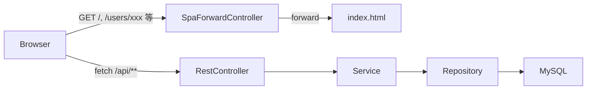

# 設計書

## アーキテクチャ概要

現行のレイヤードアーキテクチャ(Controller→Service→Repository)のうち、**Presentation Layerのみ**をThymeleaf(SSR)からVue 3 SPA + REST APIへ置き換える。Service/Repository/Entityレイヤーは変更しない。

```
移行前:
Browser → Controller(@Controller, Thymeleafビュー返却) → Service → Repository → MySQL

移行後:
Browser → Vue 3 SPA(静的ファイル, Spring Bootのstatic/から配信)
              │ fetch/axios (JSON, /api/** , credentials:include)
              ▼
        RestController(@RestController, /api/**) → Service → Repository → MySQL
                                                       ↑ 変更なし
```

デプロイは単一Webサービス構成を維持する。Vueのビルド成果物(`dist/`)を`src/main/resources/static/`に出力し、Spring Bootが静的ファイルとして配信する。API(`/api/**`)以外の全パスはSPAの`index.html`にフォワードし、クライアントサイドルーティング(Vue Router)に委譲する。



## コンポーネント設計

### 1. バックエンド: RestController群(既存Controller置き換え)

**責務**:
- 既存の`@Controller`(Thymeleafビュー名を返す)を`@RestController`に置き換え、DTOをJSONで返す
- URLは`/api`プレフィックスを付与する(例: `/users/{username}` → `/api/users/{username}`)。クライアントサイドルート(Vue Router側の同名パス)との衝突を避けるため
- バリデーションエラーは例外としてスローし、`GlobalExceptionHandler`が構造化JSONに変換する

**実装の要点**:
- 既存のService呼び出しロジックはそのまま流用する(所有権チェック・重複検証等はServiceレイヤーに既にあるため変更不要)
- `Model`への`addAttribute`は、DTOオブジェクトの構築・返却に置き換える
- リダイレクト(`return "redirect:/users/" + username`)はJSONレスポンス(作成/更新結果のDTO)に置き換え、遷移はVue Router側で行う

### 2. バックエンド: SecurityConfig(JSON対応への変更)

**責務**:
- SPAからのJSON/フォーム送信に対応した認証成功・失敗ハンドリング
- CSRF対策をCookieベースに変更し、SPA側でトークンを読み取れるようにする
- 未認証アクセス時にリダイレクトではなく401 JSONを返す

**実装の要点**:
- `formLogin`の`defaultSuccessUrl`/`failureUrl`(リダイレクト前提)を、`successHandler`/`failureHandler`に差し替え、JSON(`{username, ...}` / `{message: "..."}`)を返しつつステータスコード200/401を返す
- ログインリクエスト自体は既存の`UsernamePasswordAuthenticationFilter`をそのまま使う(`application/x-www-form-urlencoded`で送信すれば独自Filterの実装が不要。axios側で`URLSearchParams`を使う)
- CSRF: `CookieCsrfTokenRepository.withHttpOnlyFalse()`を使用し、`XSRF-TOKEN`Cookieを発行。axios側は`xsrfCookieName`/`xsrfHeaderName`を設定して自動送信させる
- `exceptionHandling().authenticationEntryPoint(...)`で未認証時は401 JSON、`accessDeniedHandler(...)`で権限エラー時は403 JSONを返す
- `authorizeHttpRequests`のパスを`/api/**`基準に書き換える。静的ファイル(`/`, `/assets/**`等)は`permitAll`

### 3. バックエンド: SpaForwardController(新規)

**責務**:
- `/api/**`・静的ファイル(拡張子あり)以外の全GETリクエストを`index.html`にフォワードし、Vue Routerのクライアントサイドルーティングを機能させる(ブラウザの直接URL入力・リロード対応)

**実装の要点**:
- `@Controller`で`@GetMapping("/{path:[^\\.]*}")`と`@GetMapping("/**/{path:[^\\.]*}")`のようなワイルドカードマッピングで`forward:/index.html`を返す
- `/api/**`は別途`authorizeHttpRequests`・マッピングで除外されるため衝突しない

### 4. フロントエンド: Vueアプリケーション本体

**責務**:
- ルーティング(Vue Router)、状態管理(Pinia)、API通信(axios)、各画面のコンポーネント実装

**実装の要点**:
- `views/`配下に現行`templates/`の機能別ディレクトリ構成を踏襲(`home/`, `auth/`, `book/`, `shelf/`, `post/`, `user/`)し、対応関係を分かりやすく保つ
- 共通レイアウト(`layout/base.html`相当)は`App.vue` + `components/Navbar.vue` + `components/Footer.vue`で再現する
- Bootstrap 5はCDNではなくnpm依存(`bootstrap`パッケージ)として導入し、Viteでバンドルする(ビルド成果物の一体管理のため)
- 注記: `docs/product-requirements.md`に記載の「月別読書グラフ(Chart.js)」は、実装前調査の結果、現行コードベース(`StatsService`等)に未実装であることが判明した。本移行は「既存画面のSPA化」が対象でありスコープ外の新機能追加は行わないため、この機能はSPA移行対象から除外する

### 5. フロントエンド: API通信層

**責務**:
- axiosインスタンスの共通設定(`baseURL: /api`, `withCredentials: true`, CSRF連携)
- 機能別APIモジュール(`api/users.ts`, `api/posts.ts`等)でエンドポイント呼び出しをラップする

**実装の要点**:
- axiosのレスポンス/エラーインターセプターで401検知時にログイン画面へ自動遷移、バリデーションエラー(400/422)はフォームコンポーネントに伝播させる
- 型定義(`types/`)はバックエンドDTOと1対1対応させ、フィールド名・型の齟齬を防ぐ

### 6. フロントエンド: 認証状態管理(Pinia)

**責務**:
- 現在ログイン中のユーザー情報をアプリ全体で共有する
- Vue Routerのナビゲーションガードから参照し、認証必須ページへの未ログインアクセスを防ぐ

**実装の要点**:
- アプリ起動時に`/api/me`(セッションCookieから現在ユーザーを返す新規エンドポイント)を呼び、ログイン状態を復元する
- ログイン/ログアウトAPI成功時にストアを更新する

## データフロー

### ログインフロー
```
1. ユーザーがログインフォームに入力しSubmit
2. axiosがPOST /login (application/x-www-form-urlencoded) をwithCredentials:trueで送信
3. Spring SecurityのUsernamePasswordAuthenticationFilterが認証、成功ハンドラがJSON({username,...})を200で返す
4. Piniaのauthストアを更新
5. axiosでGET /api/me相当は不要(3のレスポンスで取得済み)、Vue RouterでホームへNavigate
```

### ISBN検索→本棚追加フロー
```
1. ユーザーがISBNを入力しSubmit
2. axios GET /api/books/search?isbn=xxx → BookSearchService → OpenBD API
3. 結果をVueコンポーネントに表示(確認画面へのルート遷移 or モーダル)
4. 「本棚に追加」クリックでaxios POST /api/shelf { bookId }
5. ShelfServiceが重複チェック・登録、成功レスポンスでVue Routerが本棚一覧画面へ遷移
```

### 記事作成フロー
```
1. 本棚から本を選択し記事作成画面へ遷移(クライアントサイドルーティング、ページ再読込なし)
2. axios POST /api/posts { bookId, title, body, isPublic }
3. PostServiceが所有権・バリデーションを実施、成功時は作成された記事DTOを返す
4. Vue Routerで記事詳細ページへ遷移
```

## エラーハンドリング戦略

### バックエンド

- 既存のカスタム例外(`BookNotFoundException`, `DuplicateRecordException`, `AccessDeniedException`, `ResourceNotFoundException`, `ExternalApiException`)は変更せず流用する
- `GlobalExceptionHandler`(`@ControllerAdvice` → `@RestControllerAdvice`に変更)で各例外を構造化JSONエラーレスポンスに変換する

```json
{
  "status": 404,
  "code": "BOOK_NOT_FOUND",
  "message": "該当する書籍が見つかりませんでした"
}
```

- バリデーションエラー(`MethodArgumentNotValidException`)はフィールド単位のエラー配列を含める:

```json
{
  "status": 400,
  "code": "VALIDATION_ERROR",
  "fieldErrors": [{"field": "username", "message": "ユーザー名は必須です"}]
}
```

### フロントエンド

- axiosのレスポンスインターセプターでエラーコード別に共通処理を行う:
  - 401 → ログイン画面へリダイレクト + authストアクリア
  - 403 → 権限エラーページ表示
  - 400/422(VALIDATION_ERROR) → フォームコンポーネントに`fieldErrors`を渡してインライン表示
  - 5xx → 共通エラーコンポーネント表示
- Vue Routerの`catch-all`ルート(`/:pathMatch(.*)*`)で未知パスは404コンポーネントを表示する(Thymeleafの`error/404.html`はこれに置き換え)

## テスト戦略

### バックエンド(既存を維持・拡張)

- Serviceレイヤーのユニットテストは変更不要(ビジネスロジック自体は変わらない)
- Controllerテストは`@WebMvcTest`のまま、JSONレスポンスの検証(`jsonPath`)に書き換える

### フロントエンド(新規)

- **ユニットテスト**: Vitest + Vue Test Utilsで各コンポーネント・Piniaストアをテスト
- **APIモック**: MSW(Mock Service Worker)でAPIレスポンスをモックし、コンポーネント単体でのテストを可能にする
- **E2Eテスト**: 既存の手動E2Eフロー(新規登録→ISBN検索→本棚追加→記事作成→公開)をベースに、必要に応じて追加する(自動化は本フェーズのスコープ外、手動確認で代替)

## 依存ライブラリ

### フロントエンド(新規: `frontend/package.json`)

```json
{
  "dependencies": {
    "vue": "^3.5.0",
    "vue-router": "^4.4.0",
    "pinia": "^2.2.0",
    "axios": "^1.7.0",
    "bootstrap": "^5.3.3"
  },
  "devDependencies": {
    "vite": "^5.4.0",
    "@vitejs/plugin-vue": "^5.1.0",
    "typescript": "^5.6.0",
    "vue-tsc": "^2.1.0",
    "vitest": "^2.1.0",
    "@vue/test-utils": "^2.4.0",
    "msw": "^2.4.0"
  }
}
```

### バックエンド(変更)

- 削除: `spring-boot-starter-thymeleaf`, `thymeleaf-extras-springsecurity6`
- 追加: `com.github.eirslett:frontend-maven-plugin`(Maven経由でnpm install/buildをCIに組み込むため)

## ディレクトリ構造

```
Bukuro/
├── frontend/                          # 新規: Vue SPAプロジェクト
│   ├── src/
│   │   ├── main.ts
│   │   ├── App.vue
│   │   ├── router/index.ts
│   │   ├── stores/
│   │   │   └── auth.ts
│   │   ├── api/
│   │   │   ├── client.ts              # axios共通設定
│   │   │   ├── users.ts
│   │   │   ├── posts.ts
│   │   │   ├── shelf.ts
│   │   │   ├── books.ts
│   │   │   ├── follow.ts
│   │   │   └── good.ts
│   │   ├── views/
│   │   │   ├── home/IndexView.vue
│   │   │   ├── auth/{Login,Register}View.vue
│   │   │   ├── book/{Search,Confirm}View.vue
│   │   │   ├── shelf/IndexView.vue
│   │   │   ├── post/{New,Edit,Show}View.vue
│   │   │   └── user/{Show,ProfileEdit,Followers,Following}View.vue
│   │   ├── components/
│   │   │   ├── Navbar.vue
│   │   │   ├── Footer.vue
│   │   │   └── NotFound.vue
│   │   └── types/
│   ├── index.html
│   ├── vite.config.ts                 # build.outDir: ../src/main/resources/static
│   ├── tsconfig.json
│   └── package.json
├── src/main/java/com/bukuro/
│   ├── controller/                    # @RestController化 + /api プレフィックス
│   │   ├── AuthController.java
│   │   ├── UserController.java
│   │   ├── ...
│   │   └── SpaForwardController.java  # 新規
│   ├── config/
│   │   └── SecurityConfig.java        # JSON対応に変更
│   └── ...(service/repository/entity/dto/exception は変更なし)
├── src/main/resources/
│   ├── templates/                     # 削除(Thymeleaf撤去)
│   └── static/                        # frontend/dist のビルド出力先
└── pom.xml                            # frontend-maven-plugin 追加
```

## 実装の順序

1. バックエンド: `SecurityConfig`をJSON対応(成功/失敗ハンドラ、CSRF Cookie化、401/403ハンドラ)に変更
2. バックエンド: `GlobalExceptionHandler`を`@RestControllerAdvice`化し、共通エラーレスポンス形式を定義
3. バックエンド: 各Controllerを機能単位で`@RestController`(`/api`プレフィックス)へ書き換え(認証→ISBN検索→本棚→記事→マイページ/プロフィール→フォロー/グッド→ホームフィードの順)
4. バックエンド: `SpaForwardController`を追加
5. フロントエンド: `frontend/`プロジェクトの初期セットアップ(Vite + Vue3 + TS)
6. フロントエンド: axios共通クライアント・Piniaのauthストア・Vue Router雛形を実装
7. フロントエンド: 共通レイアウト(Navbar/Footer/App.vue)を実装
8. フロントエンド: 機能単位でView実装(バックエンドAPIの実装順と合わせる)
9. 統合: `vite build`の出力を`src/main/resources/static`に向け、`frontend-maven-plugin`で`mvn verify`に組み込む
10. 旧Thymeleafテンプレート・`thymeleaf-extras-springsecurity6`依存を削除
11. E2E手動確認(新規登録→ISBN検索→本棚追加→記事作成→公開の一連フロー)

## セキュリティ考慮事項

- CSRFトークンCookie(`XSRF-TOKEN`)は`httpOnly=false`にする必要があるが、JS実行コンテキストからのみ読み取り可能で、XSSがない限り第三者からは読めない。Vueのテンプレート補間はデフォルトでHTMLエスケープされるため、既存のThymeleaf `th:text`と同等のXSS対策水準を維持する
- セッションCookie自体は`httpOnly`のまま変更しない(JS側から読み取り不要のため)
- 単一オリジンでの配信を維持するため、CORS設定の追加は不要(別オリジンホスティングをスコープ外としているため)
- 既存のリソースレベル認可(Post編集・削除の所有権チェック等)はServiceレイヤーのまま変更しないため、認可ロジックの重複実装・漏れのリスクを避けられる

## パフォーマンス考慮事項

- Viteのコード分割(ルート単位の`dynamic import`)により、初回ロードのJSバンドルサイズを抑える
- Bootstrap CSSはnpm経由で必要なコンポーネントのみインポートすることも検討可能だが、初期実装ではフル`bootstrap.min.css`相当を使用し、必要に応じて最適化する
- 画像(書影)は引き続きOpenBD CDNを参照し、自前配信しない(既存方針を維持)

## 将来の拡張性

- 現状はセッションCookie認証だが、将来的にモバイルアプリ等クロスオリジンクライアントが必要になった場合はJWT化を別途検討する(本フェーズはスコープ外)
- API層を`/api`プレフィックスで明確に分離しているため、将来的にフロントエンドとバックエンドを別ホスティングに分離する場合もCORS設定の追加のみで対応可能
