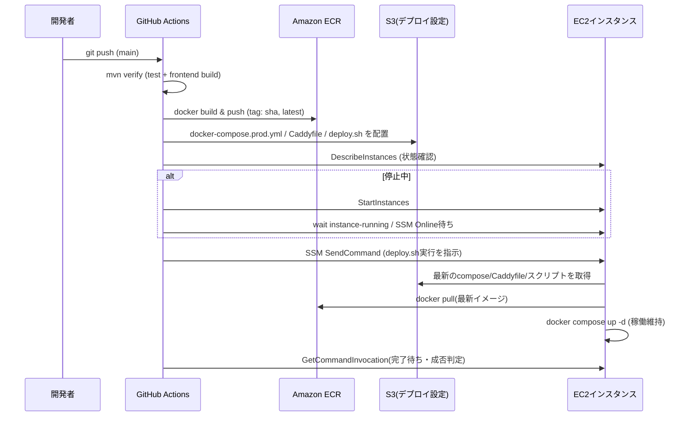

# 設計書

## 前提: 実行環境の制約

この開発環境にはAWS CLIが未インストール・未認証(`aws sts get-caller-identity`不可)。そのため、AWS上に実リソースを作成するコマンドはClaude Code側では実行できない。
本タスクでは以下の方針で進める:

- **リポジトリ内に置くもの(Claude Codeが作成・検証可能)**: Dockerfile、docker-compose.prod.yml、Caddyfile、systemdユニット、デプロイスクリプト、GitHub Actionsワークフロー。`docker build` / `docker compose config` 等ローカルで検証可能な範囲は実際に検証する。
- **ユーザーが実行するもの**: IAM/OIDC/ECR/S3/EC2/セキュリティグループなどAWSリソースの作成。`deploy/aws-setup-commands.md` に実行すべきAWS CLIコマンドを手順として列挙し、ユーザーが自身のAWSアカウントで実行する。実行後、リソースID(インスタンスID・ロールARN等)をGitHub Secrets/Variablesおよびリポジトリ内の設定に反映する。

## アーキテクチャ概要



EC2インスタンス内部:

```
┌────────────────────────── EC2 (t4g.small, Amazon Linux 2023) ──────────────────────────┐
│  systemd: bukuro-app.service (enabled) ─ OS起動時に自動で docker compose up -d を実行  │
│                                                                                          │
│  ┌────────────┐   :80    ┌──────────────┐   :8080   ┌──────────────┐                  │
│  │   Caddy     │────────▶│  app (Spring  │──────────▶│  mysql        │                 │
│  │ (reverse    │         │  Boot, ECR    │  JDBC     │  (公式イメージ)│                 │
│  │  proxy)     │         │  イメージ)     │           │               │                 │
│  └────────────┘         └──────────────┘           └──────┬───────┘                    │
│                                                              │ named volume(EBSルート上) │
│                                                        mysql_data (永続化)               │
└──────────────────────────────────────────────────────────────────────────────────────────┘
```

EBS: ルートボリューム(gp3, 30GB程度)上にDockerの名前付きボリュームとしてMySQLデータを保持。`stop`ではEBSがデタッチされないため、再`start`時もデータはそのまま残る(`terminate`時のみ消える)。

## コンポーネント設計

### 1. Dockerfile(アプリイメージ)

**責務**:
- `mvn verify`相当のビルド(フロントエンドビルド含む)をマルチステージビルドの第1ステージで実行し、実行用ステージにはJRE + jarのみを含める

**実装の要点**:
- ベースイメージ: ビルドステージ `maven:3.9-eclipse-temurin-21`、実行ステージ `eclipse-temurin:21-jre-alpine`(ARM/Graviton対応のマルチアーキビルドを意識)
- `frontend-maven-plugin`がNode.jsを自動取得するため、ビルドステージには追加のNode.jsインストール不要
- 実行時は`SPRING_PROFILES_ACTIVE=prod`、`application-prod.properties`の環境変数プレースホルダー(`DB_URL`等)経由で設定を注入
- JVMヒープは既存のarchitecture.md方針(256MB以内)を踏襲し、`-Xmx256m -Xms128m`をデフォルトに(2GBインスタンスでMySQLと同居するため厳守)

### 2. docker-compose.prod.yml

**責務**:
- app / mysql / caddy の3コンテナをまとめて起動・管理する

**実装の要点**:
- `mysql`: 公式`mysql:8.0`イメージ、`volumes: mysql_data:/var/lib/mysql`、環境変数は`.env`(EC2ローカル、Git管理外)から読み込み
- `app`: ECRのイメージを`image: ${ECR_REPOSITORY}:latest`で参照、`depends_on: mysql`、`env_file: .env`
- `caddy`: `Caddyfile`をバインドマウントし、`app:8080`へのリバースプロキシのみを行う(このフェーズではドメイン未取得のためTLS終端は行わずHTTPのみ。将来ドメインを用意した際はCaddyfileに1行追加するだけでLet's Encrypt自動化に対応できる設計とする)
- `restart: unless-stopped`を全サービスに設定し、Dockerデーモン起動時にコンテナが自動復帰するようにする

### 3. Caddyfile

**責務**:
- ポート80でリクエストを受け、`app:8080`にプロキシする

**実装の要点**:
- 現フェーズはIPアクセスのみのためTLS設定なし(`http://`のみ)。ドメイン導入時は`{$DOMAIN}`変数に差し替えるだけで自動HTTPSに移行できるコメントを残す

### 4. systemdユニット(bukuro-app.service)

**責務**:
- EC2インスタンスのOS起動時、`docker compose -f /opt/bukuro/docker-compose.prod.yml up -d`を自動実行する

**実装の要点**:
- `After=docker.service`, `Requires=docker.service`
- `Type=oneshot`, `RemainAfterExit=yes`
- `systemctl enable bukuro-app.service`しておくことで、`aws ec2 start-instances`だけでサービスが復活する(SSH不要)
- EC2初期セットアップ時(`ec2-init.sh`)に一度だけ配置・有効化する

### 5. デプロイスクリプト(deploy.sh)

**責務**:
- GitHub ActionsからSSM経由で呼び出され、EC2上で最新の設定・イメージを反映する

**実装の要点**:
- `set -euo pipefail`で途中失敗時は即座に非ゼロ終了し、SSMのコマンド実行結果に失敗を反映させる
- 手順: (1) S3から`docker-compose.prod.yml`/`Caddyfile`を`/opt/bukuro/`に同期 (2) `aws ecr get-login-password`でECRにログイン (3) `docker compose pull` (4) `docker compose up -d` (5) `docker image prune -f`で古いイメージを削除しディスク圧迫を防止
- `.env`ファイルはこのスクリプトが一切書き換えない(機密情報を保護するため、初期セットアップ時に手動作成したものを使い続ける)

### 6. GitHub Actionsワークフロー(.github/workflows/deploy.yml)

**責務**:
- mainへのpushをトリガーに、テスト→ビルド→ECR push→EC2起動確認→SSMデプロイの一連を実行する

**実装の要点**:
- `permissions: id-token: write, contents: read`でOIDCトークンを発行
- `aws-actions/configure-aws-credentials@v4`で`role-to-assume`(GitHub Actions用IAMロールARN、リポジトリVariablesに設定)を使いAssumeRoleWithWebIdentity
- ジョブ構成: `test`(既存CI相当、mysqlサービスコンテナで`mvn verify`) → `build-and-push`(Dockerビルド・ECR push・S3へのdeploy用ファイル配置) → `deploy`(EC2起動確認・SSM実行・結果待機)
- EC2起動待ちは`aws ec2 wait instance-running`後、SSM Agentがオンラインになるまで`aws ssm describe-instance-information`をポーリング(タイムアウト5分)
- SSMコマンド完了待ちは`aws ssm wait command-executed`、失敗時は`aws ssm get-command-invocation`のstderrをジョブログに出力してジョブを失敗させる

## データフロー

### 通常デプロイ(インスタンス稼働中にpush)
```
1. 開発者がmainにpush
2. GitHub Actionsがtestジョブを実行、失敗すれば以降のジョブは実行されない
3. build-and-pushジョブでDockerイメージをビルドしECRにpush、deploy/配下のファイルをS3にsync
4. deployジョブでDescribeInstancesするとrunning状態のため起動処理はスキップ
5. SSM SendCommandでdeploy.shを実行、S3から最新設定取得→イメージpull→docker compose up -d
6. GetCommandInvocationでSuccessを確認しジョブ成功
```

### 停止中インスタンスへのデプロイ
```
1〜3. 上記と同様
4. deployジョブでDescribeInstancesするとstopped状態のため StartInstances を実行
5. instance-runningになるまで待機、続けてSSM Agentのオンライン化を待機
6. SSM SendCommandでdeploy.shを実行(以降は通常デプロイと同じ)
7. デプロイ完了後もインスタンスは稼働状態のまま維持する(明示的な再停止は行わない。次に停止する場合は開発者が手動でaws ec2 stop-instancesを実行する)
```

### インスタンス手動停止→起動
```
1. 開発者がAWSコンソール/CLIでstop-instances
2. (EBSは保持されるためDBデータは消えない)
3. 開発者が必要な時にstart-instances
4. OS起動→systemdがbukuro-app.serviceを自動実行→docker compose up -dでコンテナ群が復帰
5. 開発者がDescribeInstancesで新しいパブリックIPを確認してアクセス
```

## エラーハンドリング戦略

- **testジョブ失敗**: 以降のジョブをすべてスキップ(GitHub Actionsのjobs.<id>.needsで直列化)。AWSには一切触れない
- **ECR push失敗**: deployジョブに進まないため、稼働中のEC2には影響しない(現行バージョンが動き続ける)
- **EC2起動タイムアウト**: `aws ec2 wait instance-running`が既定のタイムアウトで失敗した場合、ジョブを失敗させ通知。手動でAWSコンソールを確認する運用とする
- **SSMコマンド失敗(deploy.sh内でのエラー)**: `set -euo pipefail`により該当ステップで即終了。`docker compose up -d`実行前に失敗した場合は旧コンテナが動き続けるため、サービス断は発生しない。`docker compose up -d`自体が失敗した場合はCaddy/DBが起動したままapp コンテナのみ落ちる可能性があるため、次回デプロイ成功まで手動確認が必要(このフェーズではロールバック自動化はスコープ外)

## テスト戦略

### ローカル検証(このタスクの実装中に実施)
- `docker build .`でイメージが正常にビルドできること
- `docker compose -f deploy/docker-compose.prod.yml config`で構文エラーがないこと
- ローカルで`docker compose up`し、Caddy経由でアプリにアクセスできること(DB接続含む)

### 統合確認(AWSリソース作成後、ユーザー側で実施)
- 実際にmainへpushし、GitHub Actionsが緑になること
- ブラウザからEC2のパブリックIPでアプリにアクセスできること
- `stop-instances`→`start-instances`後、投稿したデータが残っていること・手動操作なしにサービスが復帰すること

### E2Eテスト(手動)
- 新規登録→記事投稿→ログアウト→再度アクセスしてデータが見えることを、デプロイ後の実環境で確認

## 依存ライブラリ

インフラ専用タスクのためアプリケーションの依存ライブラリ追加はなし。GitHub Actionsで使用するアクションのみ:

```yaml
uses:
  - actions/checkout@v4
  - actions/setup-java@v4
  - aws-actions/configure-aws-credentials@v4
  - aws-actions/amazon-ecr-login@v2
  - docker/setup-buildx-action@v3
  - docker/build-push-action@v6
```

## ディレクトリ構造

```
Bukuro/
├── Dockerfile                          # 新規: マルチステージビルド
├── .dockerignore                       # 新規
├── deploy/
│   ├── docker-compose.prod.yml         # 新規: EC2上で稼働させる構成定義
│   ├── Caddyfile                       # 新規: リバースプロキシ設定
│   ├── deploy.sh                       # 新規: SSM経由で実行されるデプロイスクリプト
│   ├── ec2-init.sh                     # 新規: EC2初期セットアップ用(手動実行、初回のみ)
│   ├── bukuro-app.service              # 新規: systemdユニット定義
│   └── aws-setup-commands.md           # 新規: ユーザーが実行するAWS CLIコマンド手順書
├── .github/workflows/
│   └── deploy.yml                      # 新規: CI+CD自動デプロイワークフロー
└── docs/
    └── architecture.md                 # 更新: デプロイ構成セクションをAWS EC2に書き換え
```

## 実装の順序

1. `Dockerfile` / `.dockerignore` 作成 → ローカルで`docker build`検証
2. `deploy/docker-compose.prod.yml` / `Caddyfile` 作成 → ローカルで`docker compose up`検証(DB接続・画面表示まで)
3. `deploy/bukuro-app.service` / `deploy/ec2-init.sh` / `deploy/deploy.sh` 作成
4. `deploy/aws-setup-commands.md`(OIDC provider・IAMロール2種・ECRリポジトリ・S3バケット・セキュリティグループ・EC2インスタンス作成コマンド一式)を作成
5. `.github/workflows/deploy.yml` 作成
6. `docs/architecture.md`のデプロイ構成セクション、`README.md`の本番デプロイ手順をAWS EC2向けに更新
7. (ユーザー側)`aws-setup-commands.md`に従いAWSリソースを作成し、GitHub Secrets/VariablesにロールARN・インスタンスID・ECRリポジトリURL等を設定
8. (ユーザー側)実際にpushして自動デプロイを確認、stop/start確認

## セキュリティ考慮事項

- EC2セキュリティグループはインバウンド80番(将来443番)のみ許可し、22番(SSH)は開放しない。運用はSSM Session Manager/Send-Commandのみで行う
- GitHub Actions用IAMロールは、対象ECRリポジトリ・対象EC2インスタンスID・対象S3バケットに絞った最小権限ポリシーとする(ワイルドカードの`*`リソース権限を避ける)
- EC2側のIAMインスタンスプロファイルも同様に、SSMコア権限・ECR読み取り・対象S3バケット読み取りのみに限定
- DB接続情報・Spring Securityの秘密鍵等は`.env`(EC2ローカル、Git管理外、初回手動作成)にのみ保持し、リポジトリやS3、GitHub Actionsログに一切含めない
- ECRイメージスキャン(push時のBasic scanning)を有効化し、既知脆弱性を検知する

## パフォーマンス考慮事項

- インスタンスタイプ`t4g.small`(2 vCPU / 2GB)を想定。JVMヒープ256MB上限 + MySQLの`innodb_buffer_pool_size`を128MB程度に抑える設定を`.env`/`my.cnf`で明示し、OOMを防ぐ
- 2GBメモリでアプリ・DB・Caddyを同居させるため、1GB程度のswapファイルをEC2初期セットアップ(`ec2-init.sh`)で作成しておく

## 将来の拡張性

- ドメイン取得後: Caddyfileの1行変更(`:80` → `example.com`)で自動HTTPS化。あわせてRoute53 + 起動時DNS更新スクリプトの追加を検討
- スケール時: MySQLをRDSに切り出し、EC2はアプリ専用にする(データディレクトリの移行が必要)
- 可用性向上時: Elastic IP固定、ALB導入、Auto Scaling Group化(その際は「基本停止」運用とは別のコスト方針になる点に留意)
