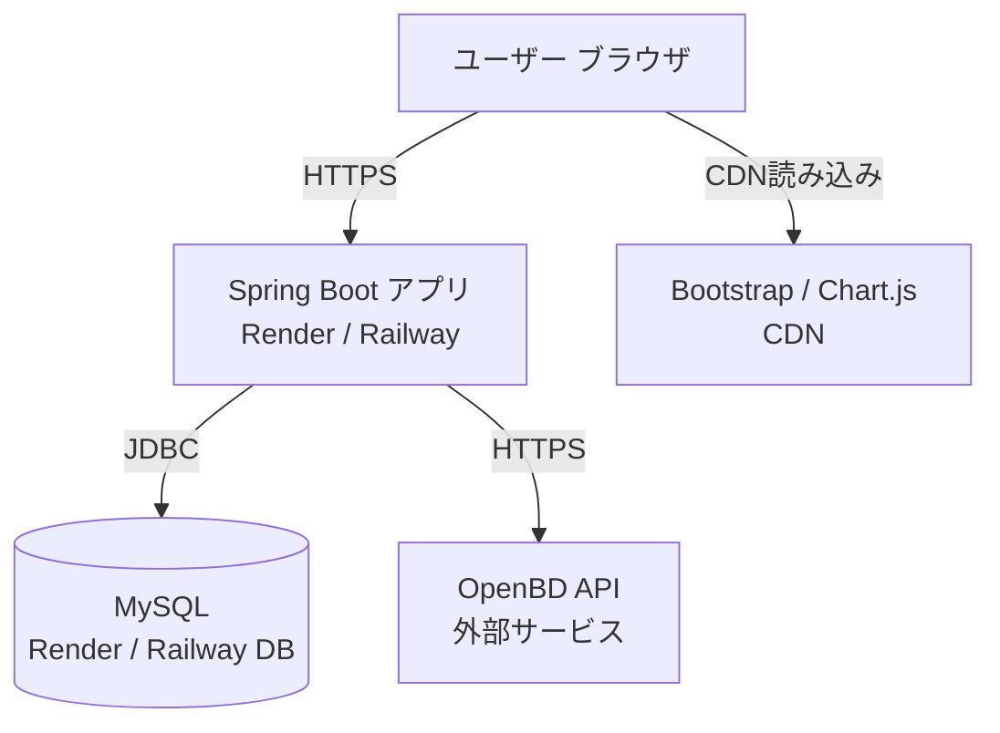

# 技術仕様書 (Architecture Design Document)

## テクノロジースタック

### 言語・ランタイム

| 技術 | バージョン | 選定理由 |
|------|-----------|----------|
| Java | 21 (LTS) | 2031年9月まで長期サポート。Spring Boot 3.xの推奨ランタイム。仮想スレッドによる高スループット |
| Spring Boot | 3.3.x | Java標準のWebフレームワーク。Spring Security・JPA・MVC等のエコシステムが一体化 |
| Maven | 3.9.x | Spring Boot標準のビルドツール。依存関係管理とビルドライフサイクルを統一 |

### フレームワーク・ライブラリ

| 技術 | バージョン | 用途 | 選定理由 |
|------|-----------|------|----------|
| Spring MVC | 6.x (Spring Boot内包) | Webリクエストルーティング | Controller→Service→Repository の標準レイヤー構成 |
| Spring Security | 6.x (Spring Boot内包) | 認証・認可・CSRF対策 | セッション管理・BCrypt・CSRF保護が標準搭載 |
| Spring Data JPA | 3.x (Spring Boot内包) | ORM・DBアクセス | リポジトリパターンによるCRUD自動生成 |
| Hibernate | 6.x (JPA実装) | SQLの自動生成・マッピング | JPA実装として業界標準 |
| Thymeleaf | 3.x | サーバーサイドHTMLテンプレート | Spring MVCとの統合が容易。HTMLとしてそのまま開けるナチュラルテンプレート |
| MySQL Connector/J | 8.x | JDBCドライバ | MySQL 8.xに対応した公式ドライバ |
| Lombok | 最新安定版 | ボイラープレートコード削減 | Getter/Setter/Builder等のアノテーション自動生成 |

### フロントエンド

| 技術 | バージョン | 用途 | 選定理由 |
|------|-----------|------|----------|
| Chart.js | 4.x | 月別読書グラフ描画 | 軽量・設定簡単なJSグラフライブラリ。CDN経由で導入可能 |
| Bootstrap | 5.x | レスポンシブCSSフレームワーク | スマートフォン対応のグリッドシステム。開発速度向上 |

### 開発ツール

| 技術 | 用途 | 選定理由 |
|------|------|----------|
| devcontainer | 開発環境コンテナ | チーム間の環境差異を排除。Java・MySQL・Maven を含む統一環境 |
| JUnit 5 | ユニットテスト | Spring Boot Testとの統合が標準 |
| Mockito | モックライブラリ | JUnit 5との統合。ServiceレイヤーのRepositoryモック |
| TestContainers | 統合テスト用DBコンテナ | テスト専用MySQLコンテナを起動して実DBで検証 |

---

## アーキテクチャパターン

### レイヤードアーキテクチャ（Spring MVC標準）

```
┌──────────────────────────────────────────────┐
│   Presentation Layer（Controller + Thymeleaf）│  ← HTTPリクエスト受付・HTMLレスポンス
├──────────────────────────────────────────────┤
│   Service Layer（@Service）                   │  ← ビジネスロジック
├──────────────────────────────────────────────┤
│   Repository Layer（@Repository / JPA）       │  ← DB操作
├──────────────────────────────────────────────┤
│   Database（MySQL）                           │  ← データ永続化
└──────────────────────────────────────────────┘

外部連携:
  Service Layer ─────→ OpenBD API（ISBN→書誌情報）
  Presentation Layer → Chart.js（ブラウザ側グラフ描画）
```

#### Presentation Layer（Controller）
- **責務**: リクエストのルーティング、入力バリデーション（`@Valid`）、Thymeleafへのモデル渡し
- **禁止**: Repositoryへの直接アクセス、ビジネスロジックの実装

#### Service Layer
- **責務**: ビジネスロジック（所有権チェック・重複検証・ステータス遷移）、外部APIコール
- **禁止**: Thymeleafテンプレートへの依存、直接的なHTTPレスポンス操作

#### Repository Layer
- **責務**: DB操作（CRUD）、カスタムクエリ（JPQL/ネイティブSQL）
- **禁止**: ビジネスロジックの実装

---

## システム構成（デプロイ構成）



### デプロイ先: Render または Railway

| 項目 | 内容 |
|------|------|
| アプリサーバー | Render Web Service または Railway App |
| データベース | Railway MySQL または Render MySQL (MySQL 8.x) |
| 環境変数管理 | Render/Railway のダッシュボードで設定（コードにハードコードしない） |
| デプロイ方法 | GitHubリポジトリと連携した自動デプロイ（main push時） |

---

## データ永続化戦略

### ストレージ方式

| データ種別 | ストレージ | 理由 |
|-----------|----------|------|
| ユーザー・本棚・記事データ | MySQL | リレーショナルデータ。外部キー制約・トランザクション必須 |
| セッションデータ | サーバーメモリ（Spring Security デフォルト） | 初期実装はメモリセッション。スケール時はRedisに移行 |
| 書影画像 | OpenBD CDN URLを参照（自前保存なし） | 初期実装はURLのみ保存。OpenBD側で削除された場合はnullとして扱う |

### バックアップ戦略

- **方式**: Render / Railway のマネージドDBの自動バックアップ機能を利用
- **頻度**: 日次（PaaSのデフォルト設定に準拠）
- **復元方法**: PaaSのダッシュボードまたはCLIからポイントインタイムリストア

---

## パフォーマンス要件

### レスポンスタイム

| 操作 | 目標時間 | 備考 |
|------|---------|------|
| ページ初回表示（HTML生成） | 500ms以内 | DB1〜3クエリ想定 |
| ISBN検索（OpenBD APIコール含む） | 3秒以内 | 外部API依存。タイムアウトは3秒設定 |
| 記事一覧表示（100件） | 1秒以内 | ページネーション（20件/ページ）で運用 |
| グッド追加 | 500ms以内 | DB書き込み1件 + good_count更新 |

### ページネーション方針

- 記事一覧・本棚一覧: 20件/ページ（Spring Data PageableにてLIMIT/OFFSET）
- 全公開記事フィード: 20件/ページ

### リソース使用量（Renderフリープラン基準）

| リソース | 上限 | 対応方針 |
|---------|------|---------|
| メモリ | 512MB | Spring Boot起動時のヒープを256MB以内に抑制 |
| 同時接続 | 100リクエスト/秒以下 | 初期フェーズは100ユーザー想定のため問題なし |

---

## セキュリティアーキテクチャ

### 認証・セッション管理

```
Spring Security Configuration
├── パスワード: BCryptPasswordEncoder(strength=12)
├── セッション: HttpSession（サーバー側保持）
├── CSRF: CsrfFilter（全POSTフォームにトークン付与）
└── セキュリティヘッダー: X-Frame-Options, X-Content-Type-Options（デフォルト有効）
```

### アクセス制御

```
URL ベースの認可（SecurityFilterChain）
├── permitAll: GET /, /login, /register, /posts/{id}, /users/{username}, /books/{bookId}
└── authenticated: その他すべて

リソースレベルの認可（ServiceLayer）
├── Post編集・削除: post.userId == currentUserId
├── ReadingRecord操作: record.userId == currentUserId
└── Profile編集: targetUserId == currentUserId
```

### データ保護

| 脅威 | 対策 |
|------|------|
| SQLインジェクション | Spring Data JPA パラメータバインディング（PreparedStatement） |
| XSS | Thymeleaf デフォルトHTMLエスケープ（`th:text`） |
| CSRF | Spring Security CSRFトークン（`_csrf` hidden field） |
| パスワード漏洩 | BCrypt(strength=12) ハッシュ化。平文保存禁止 |
| 機密情報漏洩 | DB接続情報・シークレットキーは環境変数管理（`application.properties` にハードコードしない） |

### 機密情報の管理方針

```
application.properties（バージョン管理に含める）
  → DB接続はプレースホルダー ${DB_URL} のみ記述

application-local.properties（.gitignoreで除外）
  → ローカル開発用の実際の接続情報

環境変数（Render / Railway ダッシュボード）
  → 本番環境の DB_URL, DB_USERNAME, DB_PASSWORD 等
```

---

## スケーラビリティ設計

### データ増加への対応

- **想定データ量（初期）**: ユーザー100人 × 本棚50冊 = 5,000レコード / 記事10,000件
- **インデックス設計**:
  - `reading_records(user_id, status)` — 本棚タブ切り替えクエリの高速化
  - `posts(user_id, is_public, created_at DESC)` — マイページ・ユーザーページ
  - `posts(is_public, created_at DESC)` — 全公開記事フィード
  - `follows(follower_id)` — フォロー中ユーザーIDの取得
  - `goods(user_id, post_id)` — グッド済みチェック（UNIQUE制約が兼任）

### 機能拡張性

| 拡張項目 | 対応方針 |
|---------|---------|
| セッションのスケールアウト | Redis Session（Spring Session）に切り替え |
| 書影のS3保存 | `BookService` のcover_url保存ロジックを差し替え（OpenBD URL → S3 URL） |
| 全文検索 | `PostRepository` のLIKEクエリをElasticsearch連携に移行 |
| メール通知（将来） | Spring Mail + 非同期処理（`@Async`）で実装 |

---

## テスト戦略

### ユニットテスト（JUnit 5 + Mockito）

- **対象**: Serviceレイヤー全クラス
- **方針**: Repositoryをモックし、ビジネスロジックのみを検証
- **カバレッジ目標**: Serviceレイヤー 80%以上
- **重点テストケース**:
  - `ShelfService`: 重複本棚登録の拒否
  - `PostService`: 他ユーザーの記事編集・削除の拒否
  - `GoodService`: 重複グッドの拒否・good_countの同期
  - `BookSearchService`: OpenBD APIのタイムアウト・未発見ケース

### 統合テスト（Spring Boot Test + TestContainers）

- **対象**: RepositoryレイヤーとDB制約の検証
- **方針**: TestContainersでMySQL 8.xコンテナを起動してテスト実行
- **重点テストケース**:
  - `ReadingRecordRepository`: (user_id, book_id) UNIQUE制約
  - `GoodRepository`: (user_id, post_id) UNIQUE制約
  - `PostRepository`: `is_public=true` フィルタリング
  - `FollowRepository`: フォロー・フォロワー取得クエリ

### E2Eテスト（手動）

- 新規登録→ISBN検索→本棚追加→記事作成→公開の一連フロー
- ログインしていない状態での非公開記事アクセス拒否

---

## CI/CDパイプライン

### GitHub Actions（CIパイプライン）

```yaml
# .github/workflows/ci.yml
name: CI

on:
  push:
    branches: [ main, develop ]
  pull_request:
    branches: [ develop ]

jobs:
  test:
    runs-on: ubuntu-latest

    services:
      mysql:
        image: mysql:8.0
        env:
          MYSQL_ROOT_PASSWORD: root
          MYSQL_DATABASE: bukuro_test
        ports:
          - 3306:3306
        options: --health-cmd="mysqladmin ping" --health-interval=10s

    steps:
      - uses: actions/checkout@v4
      - uses: actions/setup-java@v4
        with:
          java-version: '21'
          distribution: 'temurin'
          cache: maven

      - name: Run tests with coverage
        run: mvn verify
        env:
          DB_URL: jdbc:mysql://localhost:3306/bukuro_test
          DB_USERNAME: root
          DB_PASSWORD: root

      - name: Upload coverage report
        uses: actions/upload-artifact@v4
        with:
          name: jacoco-report
          path: target/site/jacoco/
```

### パイプライン方針

| ステップ | 内容 |
|---------|------|
| ビルド | `mvn verify`（ユニットテスト + 統合テスト + JaCoCoカバレッジ） |
| テスト | JUnit 5 + Mockito（ユニット） / TestContainers → GitHub Actions MySQL service（統合） |
| カバレッジ | JaCoCoレポートをartifactとして保存。Serviceレイヤー80%以上を目標 |
| デプロイ | `main` ブランチへのマージ時にRender/Railwayが自動デプロイ |

---

## 技術的制約

### 環境要件

| 項目 | 要件 |
|------|------|
| Java | 21 以上（LTS） |
| MySQL | 8.0 以上 |
| メモリ | 512MB 以上（本番環境） |
| 外部依存 | OpenBD API（書誌情報取得。オフライン不可） |

### OpenBD API 利用上の制約

| 制約 | 対応 |
|------|------|
| 利用条件: 本の販促・紹介目的のみ | 読書記録・紹介サービスとして適合。転用禁止 |
| データの改変禁止 | 書誌情報（タイトル・著者等）のユーザー編集機能を設けない |
| 削除要請への対応 | 管理者が書籍レコードを削除できる管理機能を実装 |
| 書影URLの変更・削除リスク | 初期実装はURLのまま保存。将来的にS3コピーを検討 |
| APIキー不要・無料 | 認証情報の管理不要。ただし利用規約変更を定期的に確認 |

---

## 依存関係管理

| ライブラリ | 用途 | バージョン管理方針 |
|-----------|------|-------------------|
| spring-boot-starter-web | Spring MVC | Spring Boot BOMに従う（固定） |
| spring-boot-starter-security | 認証・CSRF | Spring Boot BOMに従う（固定） |
| spring-boot-starter-data-jpa | ORM | Spring Boot BOMに従う（固定） |
| spring-boot-starter-thymeleaf | テンプレートエンジン | Spring Boot BOMに従う（固定） |
| thymeleaf-extras-springsecurity6 | Thymeleaf + Security統合 | Spring Boot BOMに従う（固定） |
| mysql-connector-j | JDBCドライバ | Spring Boot BOMに従う（固定） |
| lombok | ボイラープレート削減 | 最新安定版（`provided`スコープ） |
| spring-boot-starter-test | テストフレームワーク | Spring Boot BOMに従う（固定） |
| testcontainers | 統合テスト用DBコンテナ | 最新安定版（testスコープ） |

**方針**: Spring Boot BOMを採用することで、ライブラリ間の互換性はSpringチームが保証する。BOM外のライブラリのみ個別にバージョン管理する。
