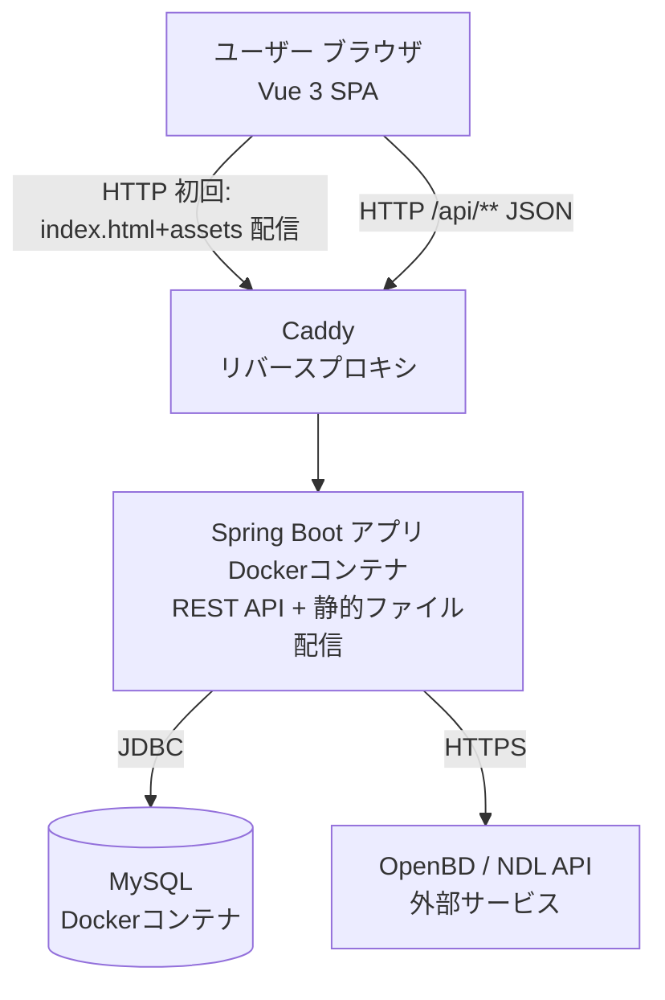

# 技術仕様書 (Architecture Design Document)

## テクノロジースタック

### 言語・ランタイム

| 技術 | バージョン | 選定理由 |
|------|-----------|----------|
| Java | 21 (LTS) | 2031年9月まで長期サポート。Spring Boot 3.xの推奨ランタイム。仮想スレッドによる高スループット |
| Spring Boot | 3.3.x | Java標準のWebフレームワーク。Spring Security・JPA・MVC等のエコシステムが一体化 |
| Maven | 3.9.x | Spring Boot標準のビルドツール。依存関係管理とビルドライフサイクルを統一 |

### フレームワーク・ライブラリ

| 技術 | バージョン | 用途 | 選定理由 |
|------|-----------|------|----------|
| Spring MVC | 6.x (Spring Boot内包) | Webリクエストルーティング | Controller→Service→Repository の標準レイヤー構成 |
| Spring Security | 6.x (Spring Boot内包) | 認証・認可・CSRF対策 | セッション管理・BCrypt・CSRF保護が標準搭載 |
| Spring Data JPA | 3.x (Spring Boot内包) | ORM・DBアクセス | リポジトリパターンによるCRUD自動生成 |
| Hibernate | 6.x (JPA実装) | SQLの自動生成・マッピング | JPA実装として業界標準 |
| MySQL Connector/J | 8.x | JDBCドライバ | MySQL 8.xに対応した公式ドライバ |
| Lombok | 最新安定版 | ボイラープレートコード削減 | Getter/Setter/Builder等のアノテーション自動生成 |

### フロントエンド

SPA(Single Page Application)構成。バックエンドはJSON APIのみを提供し、画面描画は全てブラウザ側のVueアプリケーションが担う。

| 技術 | バージョン | 用途 | 選定理由 |
|------|-----------|------|----------|
| Vue 3 | 3.5.x | UIフレームワーク | Composition API・`<script setup>`による簡潔な記述。Thymeleafのテンプレート構文に近く移行時の学習コストが低い |
| TypeScript | 5.x | 型付きJavaScript | バックエンドDTOとの型整合性をコンパイル時に検証 |
| Vite | 5.x | ビルドツール・開発サーバー | 高速な開発体験。ビルド成果物を`src/main/resources/static`に直接出力し単一サービスデプロイを維持 |
| Vue Router | 4.x | クライアントサイドルーティング | 認証必須ルートのナビゲーションガードをサポート |
| Pinia | 2.x | 状態管理 | Vue公式の状態管理ライブラリ。認証状態(現在ユーザー)をアプリ全体で共有 |
| axios | 1.x | HTTP通信 | Cookieベース認証(`withCredentials`)・CSRFトークンのCookie/ヘッダー連携が標準搭載 |
| Bootstrap | 5.x | レスポンシブCSSフレームワーク | npm依存として導入しViteでバンドル。移行前と同一のスタイルを踏襲 |
| Vitest | 2.x | フロントエンドユニットテスト | Viteとの統合が標準。Piniaストア・コンポーネントのテストに使用 |
| Vue Test Utils | 2.x | コンポーネントテストユーティリティ | 公式のVueコンポーネントテストライブラリ |

### 開発ツール

| 技術 | 用途 | 選定理由 |
|------|------|----------|
| devcontainer | 開発環境コンテナ | チーム間の環境差異を排除。Java・MySQL・Maven を含む統一環境 |
| JUnit 5 | ユニットテスト | Spring Boot Testとの統合が標準 |
| Mockito | モックライブラリ | JUnit 5との統合。ServiceレイヤーのRepositoryモック |
| TestContainers | 統合テスト用DBコンテナ | テスト専用MySQLコンテナを起動して実DBで検証 |
| frontend-maven-plugin | Maven-npm連携 | `mvn verify`実行時にNode.js/npmを自動取得し、フロントエンドのビルド(`npm run build`)を`generate-resources`フェーズで実行。単一のMavenビルドでバックエンド・フロントエンド双方を検証可能にする |

---

## アーキテクチャパターン

### SPA + REST API構成

```
┌────────────────────────────────────────────────────┐
│  ブラウザ: Vue 3 SPA（Vue Router / Pinia / axios）  │  ← 画面描画・ルーティングを全てクライアント側で担当
└───────────────────┬──────────────────────────────────┘
                     │ fetch/axios（JSON, /api/**, credentials:include）
┌───────────────────▼──────────────────────────────────┐
│   Presentation Layer（@RestController）              │  ← HTTPリクエスト受付・JSONレスポンス
├──────────────────────────────────────────────────────┤
│   Service Layer（@Service）                          │  ← ビジネスロジック
├──────────────────────────────────────────────────────┤
│   Repository Layer（@Repository / JPA）              │  ← DB操作
├──────────────────────────────────────────────────────┤
│   Database（MySQL）                                  │  ← データ永続化
└──────────────────────────────────────────────────────┘

外部連携:
  Service Layer ─────→ OpenBD / NDL API（ISBN・書名→書誌情報）

静的配信:
  Vueのビルド成果物（index.html + assets/）を src/main/resources/static に配置し、
  Spring Boot が単一サービスとして配信する。/api/** 以外の全パスは
  SpaWebConfig（WebMvcConfigurer + PathResourceResolver）により index.html にフォールバックし、
  Vue Router のクライアントサイドルーティングに委譲する
```

#### Presentation Layer（Controller）
- **責務**: リクエストのルーティング、入力バリデーション（`@Valid`）、DTOのJSONレスポンス返却
- **禁止**: Repositoryへの直接アクセス、ビジネスロジックの実装

#### Service Layer
- **責務**: ビジネスロジック（所有権チェック・重複検証・ステータス遷移）、外部APIコール
- **禁止**: プレゼンテーション層（DTO変換・HTTPレスポンス）への依存

#### Repository Layer
- **責務**: DB操作（CRUD）、カスタムクエリ（JPQL/ネイティブSQL）
- **禁止**: ビジネスロジックの実装

---

## システム構成（デプロイ構成）



Vue SPAのビルド成果物(index.html・JS・CSS)はSpring Bootアプリ自身が静的ファイルとして配信するため、フロントエンド専用のCDNやホスティングは不要（単一サービスデプロイ構成を維持）。App・DB・CaddyはすべてEC2インスタンス1台の上でDocker Composeにより同居させる（詳細な構築手順は`deploy/aws-setup-commands.md`、コンポーネント定義は`deploy/docker-compose.prod.yml`を参照）。

### デプロイ先: AWS EC2（単一インスタンス構成）

| 項目 | 内容 |
|------|------|
| インスタンス | EC2 1台（`t4g.small`, Amazon Linux 2023 / arm64）。アプリ・DB・リバースプロキシをDocker Composeで同居させる |
| アプリサーバー | Spring Bootコンテナ（ECRから取得したイメージ）。Caddyコンテナがリバースプロキシとして`:80`で待ち受ける |
| データベース | MySQL 8.0コンテナ。データはEBSボリューム上のDocker名前付きボリュームに永続化（インスタンスの`stop`ではデータは消えない） |
| 運用方針 | インスタンスは基本停止しておき、必要な時のみ起動する。起動時はsystemd（`bukuro-app.service`）が自動でコンテナ群を復帰させるため、SSHでの手動操作は不要 |
| アクセス方法 | 独自ドメイン・Elastic IPは用意せず、起動の都度パブリックIPを確認してアクセスする（将来ドメインを導入すればCaddyの設定変更のみで自動HTTPS化可能） |
| 環境変数管理 | EC2上の`/opt/bukuro/.env`（Git管理外、初回のみSSM Session Managerで手動作成）で管理。コードにハードコードしない |
| デプロイ方法 | GitHub Actions（OIDCフェデレーション）からAWS SSM Send-Commandを使い、SSH鍵を使わずにデプロイを実行（main push時、インスタンス停止中でも自動起動してデプロイする） |

---

## データ永続化戦略

### ストレージ方式

| データ種別 | ストレージ | 理由 |
|-----------|----------|------|
| ユーザー・本棚・記事データ | MySQL | リレーショナルデータ。外部キー制約・トランザクション必須 |
| セッションデータ | サーバーメモリ（Spring Security デフォルト） | 初期実装はメモリセッション。スケール時はRedisに移行 |
| 書影画像 | OpenBD CDN URLを参照（自前保存なし） | 初期実装はURLのみ保存。OpenBD側で削除された場合はnullとして扱う |

### バックアップ戦略

- **方式**: EBSボリュームのスナップショット（EC2インスタンスの`stop`/`start`ではEBSは消えないため、通常運用ではこれで十分。誤操作等に備えた保険としてスナップショットを取得する）
- **頻度**: 手動、または必要に応じてAWS Backupで定期スナップショットを設定（本フェーズのスコープ外。将来の拡張候補）
- **復元方法**: スナップショットから新しいEBSボリュームを作成し、EC2にアタッチして復元

---

## パフォーマンス要件

### レスポンスタイム

| 操作 | 目標時間 | 備考 |
|------|---------|------|
| ページ初回表示（HTML生成） | 500ms以内 | DB1〜3クエリ想定 |
| ISBN検索（OpenBD APIコール含む） | 3秒以内 | 外部API依存。タイムアウトは3秒設定 |
| 記事一覧表示（100件） | 1秒以内 | ページネーション（20件/ページ）で運用 |
| グッド追加 | 500ms以内 | DB書き込み1件 + good_count更新 |

### ページネーション方針

- 記事一覧・本棚一覧: 20件/ページ（Spring Data PageableにてLIMIT/OFFSET）
- 全公開記事フィード: 20件/ページ

### リソース使用量（EC2 `t4g.small` 基準: 2 vCPU / 2GBメモリ）

| リソース | 上限 | 対応方針 |
|---------|------|---------|
| メモリ | 2GB（アプリ・MySQL・Caddyで共有） | Spring Boot起動時のヒープを256MB以内に抑制。MySQLの`innodb_buffer_pool_size`も抑制。1GBのswapファイルをOOM対策として用意 |
| 同時接続 | 100リクエスト/秒以下 | 初期フェーズは100ユーザー想定のため問題なし |

---

## セキュリティアーキテクチャ

### 認証・セッション管理

```
Spring Security Configuration
├── パスワード: BCryptPasswordEncoder(strength=12)
├── セッション: HttpSession（サーバー側保持。SPAはCookieを自動送信するcredentials:includeで連携）
├── CSRF: CookieCsrfTokenRepository（XSRF-TOKEN Cookieをhttpオンリー無効で発行）
│         + CsrfCookieFilter（CsrfTokenを強制的に読み取らせCookie発行を保証。トークンの遅延解決対策）
│         + CsrfTokenRequestAttributeHandler（axiosがCookie値をそのままヘッダーで送る方式に対応。
│           デフォルトのXorCsrfTokenRequestAttributeHandlerはSPA構成と噛み合わないため明示的に変更）
├── ログイン/ログアウト: /api/login, /api/logout（JSON成功/失敗ハンドラでリダイレクトせずステータスコードを返す）
└── セキュリティヘッダー: X-Frame-Options, X-Content-Type-Options（デフォルト有効）
```

### アクセス制御

```
URL ベースの認可（SecurityFilterChain）
├── /api/** : デフォルト authenticated
│    ├── permitAll: /api/login, /api/register, /api/me, /api/users/**,
│    │              GET /api/posts/{id:数字}（公開記事詳細）
│    └── authenticated（明示）: POST /api/users/*/follow・unfollow, /api/posts/*/good・ungood
└── /api 以外: 全てpermitAll（SPAシェル・静的アセットの配信のみで、保護すべきデータは
                全て /api 経由となるため。認証状態のUI分岐はクライアント側で行う）

リソースレベルの認可（ServiceLayer）
├── Post編集・削除: post.userId == currentUserId
├── ReadingRecord操作: record.userId == currentUserId
└── Profile編集: targetUserId == currentUserId
```

### データ保護

| 脅威 | 対策 |
|------|------|
| SQLインジェクション | Spring Data JPA パラメータバインディング（PreparedStatement） |
| XSS | Vueテンプレート補間のデフォルトHTMLエスケープ。記事本文のMarkdownレンダリング（`MarkdownContent.vue`, `MarkdownEditor.vue`のプレビュー）のみ例外的に`v-html`を使用するが、`marked`でHTML変換した後に必ず`DOMPurify`でサニタイズ（許可タグ・`href`属性のみのホワイトリスト方式）してから描画する |
| CSRF | Spring Security CSRFトークン（Cookie + `X-XSRF-TOKEN`ヘッダー、axiosが自動送信） |
| パスワード漏洩 | BCrypt(strength=12) ハッシュ化。平文保存禁止 |
| 機密情報漏洩 | DB接続情報・シークレットキーは環境変数管理（`application.properties` にハードコードしない） |

### 機密情報の管理方針

```
application.properties（バージョン管理に含める）
  → DB接続はプレースホルダー ${DB_URL} のみ記述

application-local.properties（.gitignoreで除外）
  → ローカル開発用の実際の接続情報

EC2上の /opt/bukuro/.env（Git管理外。初回のみSSM Session Managerで手動作成し、以降デプロイスクリプトは書き換えない）
  → 本番環境の DB_ROOT_PASSWORD, DB_USERNAME, DB_PASSWORD, ECR_REPOSITORY 等
```

---

## スケーラビリティ設計

### データ増加への対応

- **想定データ量（初期）**: ユーザー100人 × 本棚50冊 = 5,000レコード / 記事10,000件
- **インデックス設計**:
  - `reading_records(user_id, status)` — 本棚タブ切り替えクエリの高速化
  - `posts(user_id, is_public, created_at DESC)` — マイページ・ユーザーページ
  - `posts(is_public, created_at DESC)` — 全公開記事フィード
  - `follows(follower_id)` — フォロー中ユーザーIDの取得
  - `goods(user_id, post_id)` — グッド済みチェック（UNIQUE制約が兼任）

### 機能拡張性

| 拡張項目 | 対応方針 |
|---------|---------|
| セッションのスケールアウト | Redis Session（Spring Session）に切り替え |
| 書影のS3保存 | `BookService` のcover_url保存ロジックを差し替え（OpenBD URL → S3 URL） |
| 全文検索 | `PostRepository` のLIKEクエリをElasticsearch連携に移行 |
| メール通知（将来） | Spring Mail + 非同期処理（`@Async`）で実装 |

---

## テスト戦略

### ユニットテスト（JUnit 5 + Mockito）

- **対象**: Serviceレイヤー全クラス
- **方針**: Repositoryをモックし、ビジネスロジックのみを検証
- **カバレッジ目標**: Serviceレイヤー 80%以上
- **重点テストケース**:
  - `ShelfService`: 重複本棚登録の拒否
  - `PostService`: 他ユーザーの記事編集・削除の拒否
  - `GoodService`: 重複グッドの拒否・good_countの同期
  - `BookSearchService`: OpenBD APIのタイムアウト・未発見ケース

### 統合テスト（Spring Boot Test + TestContainers）

- **対象**: RepositoryレイヤーとDB制約の検証
- **方針**: TestContainersでMySQL 8.xコンテナを起動してテスト実行
- **重点テストケース**:
  - `ReadingRecordRepository`: (user_id, book_id) UNIQUE制約
  - `GoodRepository`: (user_id, post_id) UNIQUE制約
  - `PostRepository`: `is_public=true` フィルタリング
  - `FollowRepository`: フォロー・フォロワー取得クエリ

### E2Eテスト（手動）

- 新規登録→ISBN検索→本棚追加→記事作成→公開の一連フロー
- ログインしていない状態での非公開記事アクセス拒否

---

## CI/CDパイプライン

### GitHub Actions（`.github/workflows/deploy.yml`）

`main`ブランチへのpushをトリガーに、テスト・ビルド・AWSへのデプロイまでを1つのワークフローで実行する。3つのジョブで構成される（`needs`により直列化。前段が失敗すれば後段は実行されない）。

```
test ─→ build-and-push ─→ deploy
```

| ジョブ | 内容 |
|---------|------|
| `test` | `mvn verify`（`frontend-maven-plugin`によるフロントエンドビルド + JUnit 5/Mockito + TestContainers統合テスト + JaCoCo）に加え、`frontend/`配下で`npm run test`（Vitest）を個別実行 |
| `build-and-push` | GitHub Actions OIDCフェデレーションでAWS IAMロールをAssumeし、Dockerイメージをビルド（EC2がarm64のためQEMU + Buildxでクロスビルド）してAmazon ECRにpush。`deploy/`配下の実行時設定一式（`docker-compose.prod.yml` / `Caddyfile` / `deploy.sh`）と`src/main/resources/db/schema.sql`をS3にsync |
| `deploy` | EC2インスタンスの状態を確認し、停止中なら`start-instances`で起動してSSM Agentのオンライン化を待機。その後AWS SSM Send-Command（`AWS-RunShellScript`）でEC2上の`deploy.sh`を実行し、最新イメージのpullとコンテナ再起動を行う。デプロイ完了後もインスタンスは稼働状態のまま維持する |

### パイプライン方針

| 項目 | 内容 |
|---------|------|
| フロントエンドビルド | `mvn verify`の`generate-resources`フェーズで`frontend-maven-plugin`がNode.js/npmを自動取得し`npm run build`（vue-tsc型チェック含む）を実行。成果物は`src/main/resources/static`に出力され、以降のバックエンドビルドに組み込まれる |
| テスト | JUnit 5 + Mockito（ユニット） / TestContainers（統合） / Vitest + Vue Test Utils（フロントエンドユニット） |
| カバレッジ | JaCoCoレポートを`mvn verify`実行時に生成。Serviceレイヤー80%以上を目標 |
| 認証方式 | GitHub Actions OIDC（`aws-actions/configure-aws-credentials`）でAWS IAMロールをAssumeするため、長期のAWSアクセスキーをGitHub Secretsに保存しない |
| デプロイ手段 | AWS SSM Send-Commandを使用し、EC2への到達はSSMのみに限定（SSHポート22番は開放しない） |
| AWSリソースの構築 | GitHub Actionsからは行わない。`deploy/aws-setup-commands.md`のコマンドをユーザーが事前に一度だけ実行してIAM/ECR/S3/EC2等を用意しておく |

---

## 技術的制約

### 環境要件

| 項目 | 要件 |
|------|------|
| Java | 21 以上（LTS） |
| MySQL | 8.0 以上 |
| メモリ | 512MB 以上（本番環境） |
| 外部依存 | OpenBD API（書誌情報取得。オフライン不可） |

### OpenBD API 利用上の制約

| 制約 | 対応 |
|------|------|
| 利用条件: 本の販促・紹介目的のみ | 読書記録・紹介サービスとして適合。転用禁止 |
| データの改変禁止 | 書誌情報（タイトル・著者等）のユーザー編集機能を設けない |
| 削除要請への対応 | 管理者が書籍レコードを削除できる管理機能を実装 |
| 書影URLの変更・削除リスク | 初期実装はURLのまま保存。将来的にS3コピーを検討 |
| APIキー不要・無料 | 認証情報の管理不要。ただし利用規約変更を定期的に確認 |

---

## 依存関係管理

| ライブラリ | 用途 | バージョン管理方針 |
|-----------|------|-------------------|
| spring-boot-starter-web | Spring MVC | Spring Boot BOMに従う（固定） |
| spring-boot-starter-security | 認証・CSRF | Spring Boot BOMに従う（固定） |
| spring-boot-starter-data-jpa | ORM | Spring Boot BOMに従う（固定） |
| spring-boot-starter-validation | Bean Validation | Spring Boot BOMに従う（固定） |
| mysql-connector-j | JDBCドライバ | Spring Boot BOMに従う（固定） |
| lombok | ボイラープレート削減 | 最新安定版（`provided`スコープ） |
| spring-boot-starter-test | テストフレームワーク | Spring Boot BOMに従う（固定） |
| testcontainers | 統合テスト用DBコンテナ | 最新安定版（testスコープ） |
| frontend-maven-plugin | Maven-npm連携 | 固定バージョン管理（`pom.xml`に明記） |

### フロントエンド依存パッケージ（`frontend/package.json`）

| ライブラリ | 用途 | バージョン管理方針 |
|-----------|------|-------------------|
| vue, vue-router, pinia | フレームワーク本体 | 最新安定版（`^`によるマイナー追従） |
| axios | HTTP通信 | 最新安定版 |
| bootstrap | CSSフレームワーク | 移行前と同じメジャーバージョン(5.x)を維持 |
| marked | 記事本文（Markdown）のHTML変換 | 最新安定版 |
| dompurify | Markdown変換後HTMLのサニタイズ（XSS対策） | 最新安定版 |
| vite, @vitejs/plugin-vue, typescript, vue-tsc | ビルド・型チェック | 最新安定版 |
| vitest, @vue/test-utils, msw | フロントエンドテスト | 最新安定版 |

**方針**: Spring Boot BOMを採用することで、ライブラリ間の互換性はSpringチームが保証する。BOM外のライブラリのみ個別にバージョン管理する。
