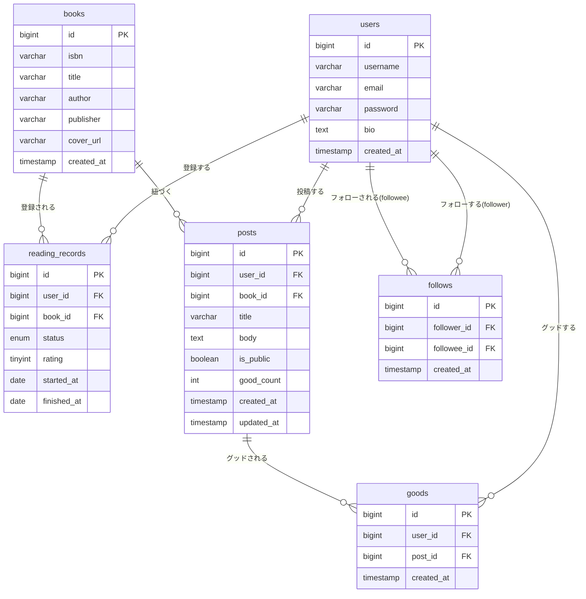
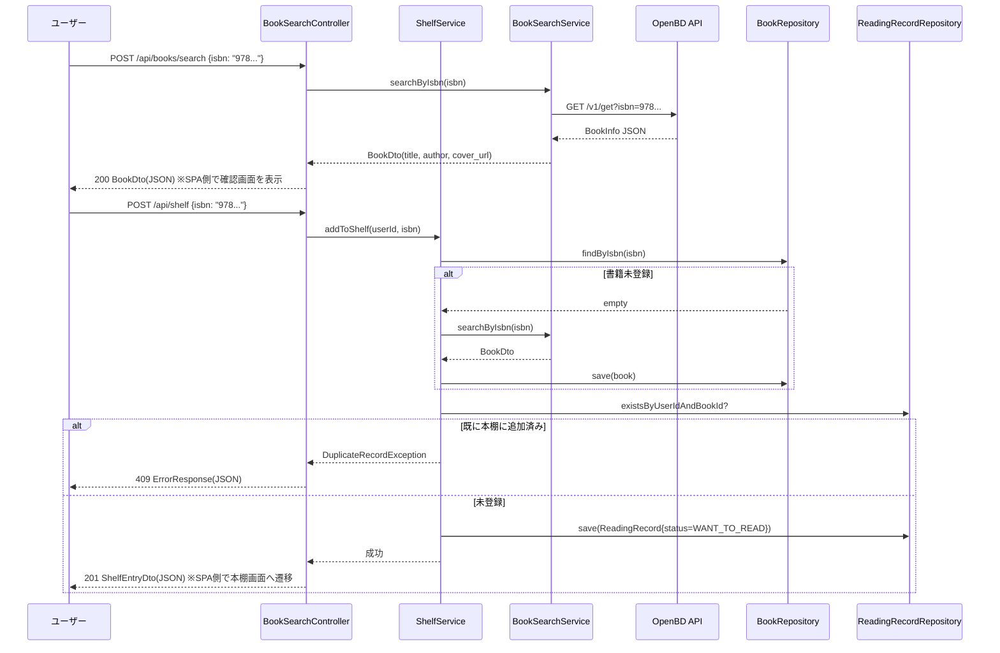
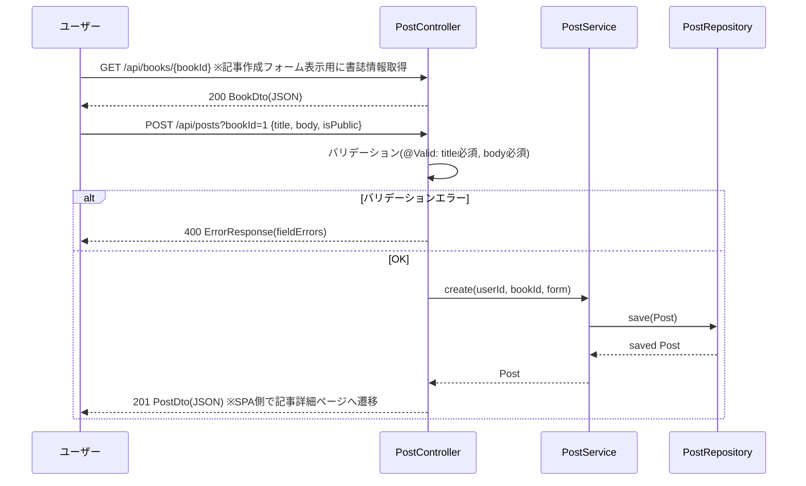
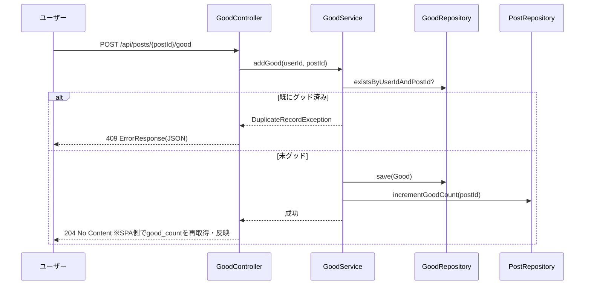
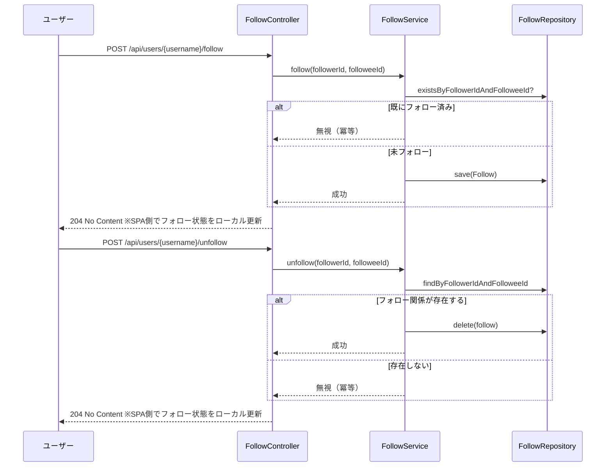
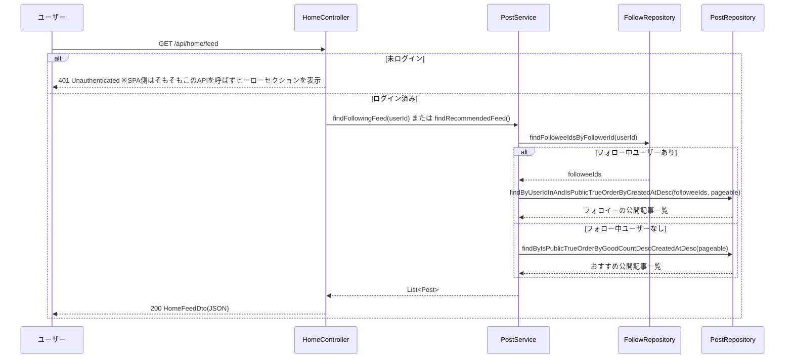
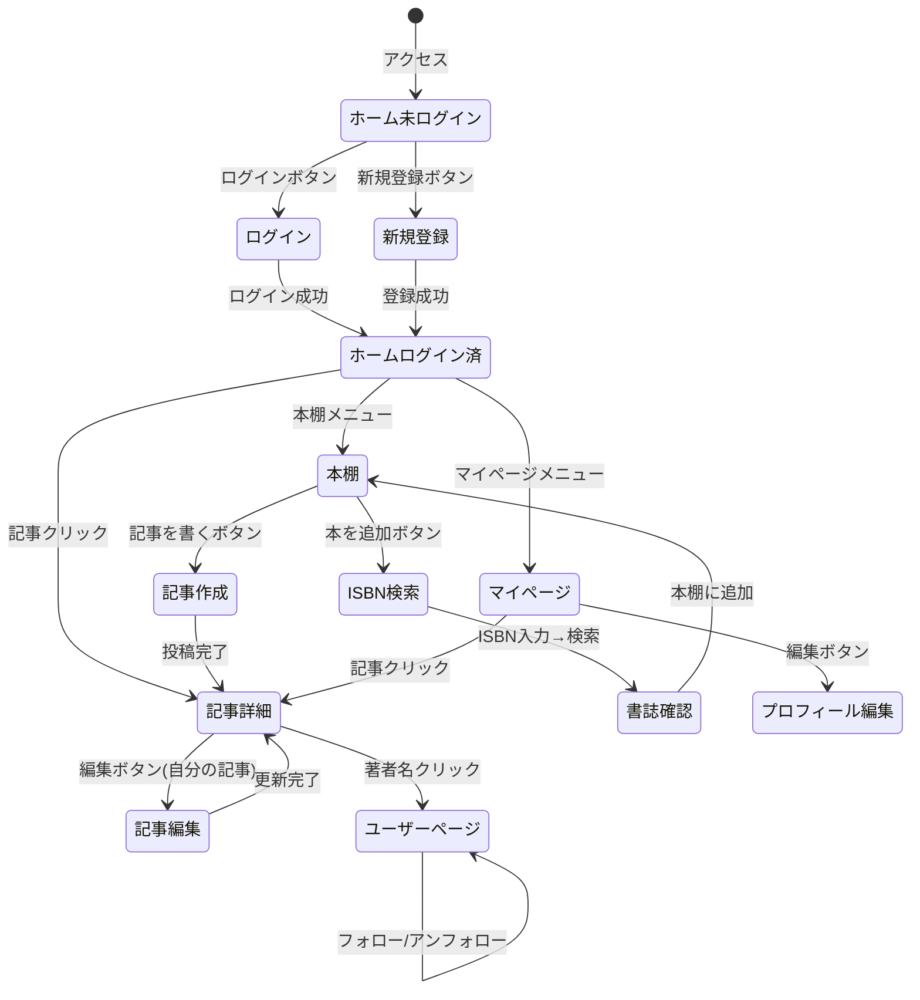

# 機能設計書 (Functional Design Document)

## システム構成図

```mermaid
graph TB
    User[ユーザー ブラウザ<br/>Vue 3 SPA]
    Controller[Controller Layer<br/>Spring MVC (@RestController)]
    Service[Service Layer<br/>ビジネスロジック]
    Repository[Repository Layer<br/>Spring Data JPA]
    DB[(MySQL)]
    OpenBD[OpenBD / NDL API<br/>外部書誌情報]

    User -->|HTTP Request /api/** JSON| Controller
    Controller --> Service
    Service --> Repository
    Repository --> DB
    Service -->|ISBN・書名検索| OpenBD
    Controller -->|JSON Response| User
```

Vue SPAのビルド成果物（index.html・JS・CSS）はSpring Bootアプリ自身が静的ファイルとして配信する（詳細は`docs/architecture.md`参照）。

---

## 技術スタック

| 分類 | 技術 | 選定理由 |
|------|------|----------|
| バックエンド | Spring Boot 3.x | Java標準のWebフレームワーク。Spring Security・JPA等のエコシステムが充実 |
| フロントエンド | Vue 3 + TypeScript + Vite | SPA構成。Composition APIによる簡潔な記述、Viteによる高速な開発体験 |
| 認証・認可 | Spring Security | CSRF対策（Cookieベース）・セッション管理・BCryptハッシュが標準で対応 |
| ORM | Spring Data JPA（Hibernate） | エンティティとDBのマッピング。CRUD操作を自動生成 |
| データベース | MySQL 8.x | リレーショナルデータの管理。本番環境に実績あり |
| 外部API | OpenBD API / NDL Search API | ISBN・書名→書誌情報の無料API。APIキー不要 |
| グラフ | （未実装） | 月別読書冊数グラフはPRD/機能設計書に記載があるが、本書執筆時点で未実装。SPA移行(2026-07-19)でも移行対象外としている。実装時はChart.js等の採用を別途検討する |
| ビルド | Maven（frontend-maven-pluginでフロントエンドビルドも統合） | Spring Boot標準のビルドツール |
| デプロイ | Render / Railway | PaaS。無料〜低コストで本番運用可能 |

---

## データモデル定義

### エンティティ: User（ユーザー）

| カラム | 型 | 制約 | 説明 |
|--------|-----|------|------|
| id | BIGINT | PK, AUTO_INCREMENT | ユーザーID |
| username | VARCHAR(50) | NOT NULL, UNIQUE | 表示名 |
| email | VARCHAR(255) | NOT NULL, UNIQUE | ログインID |
| password | VARCHAR(255) | NOT NULL | BCryptハッシュ |
| bio | TEXT | NULL | 自己紹介 |
| created_at | TIMESTAMP | NOT NULL | 登録日時 |

**制約**:
- usernameは3〜50文字
- emailは有効なメールアドレス形式
- passwordはBCrypt（strength=12）でハッシュ化

---

### エンティティ: Book（書籍）

| カラム | 型 | 制約 | 説明 |
|--------|-----|------|------|
| id | BIGINT | PK, AUTO_INCREMENT | 書籍ID |
| isbn | VARCHAR(13) | NOT NULL, UNIQUE | ISBN-13 |
| title | VARCHAR(500) | NOT NULL | タイトル |
| author | VARCHAR(500) | NOT NULL | 著者名 |
| publisher | VARCHAR(255) | NULL | 出版社 |
| cover_url | VARCHAR(1000) | NULL | OpenBDから取得した書影URL |
| created_at | TIMESTAMP | NOT NULL | 登録日時 |

**制約**:
- ISBNはISBN-13形式（13桁数字）で正規化して保存
- タイトル・著者・出版社はOpenBDから取得した値をそのまま保存（ユーザー編集不可）
- 同一ISBNは1レコードのみ（複数ユーザーが同じ本を登録しても共有）

---

### エンティティ: ReadingRecord（読書記録 / 本棚エントリ）

| カラム | 型 | 制約 | 説明 |
|--------|-----|------|------|
| id | BIGINT | PK, AUTO_INCREMENT | 読書記録ID |
| user_id | BIGINT | FK → users.id | ユーザー |
| book_id | BIGINT | FK → books.id | 書籍 |
| status | ENUM | NOT NULL | WANT_TO_READ / READING / DONE |
| rating | TINYINT | NULL | 1〜5の星評価（DONEの場合のみ） |
| started_at | DATE | NULL | 読み始め日 |
| finished_at | DATE | NULL | 読了日 |

**制約**:
- (user_id, book_id) のペアはUNIQUE（同一ユーザーが同じ本を重複登録不可）
- ratingはDONEステータスのときのみ設定可（1〜5）
- DONEからWANT_TO_READ/READINGに戻した場合、ratingはNULLにリセットする

---

### エンティティ: Post（ブログ記事）

| カラム | 型 | 制約 | 説明 |
|--------|-----|------|------|
| id | BIGINT | PK, AUTO_INCREMENT | 記事ID |
| user_id | BIGINT | FK → users.id | 投稿者 |
| book_id | BIGINT | FK → books.id | 紐づく書籍 |
| title | VARCHAR(255) | NOT NULL | 記事タイトル |
| body | TEXT | NOT NULL | 記事本文 |
| is_public | BOOLEAN | NOT NULL, DEFAULT false | 公開フラグ |
| good_count | INT | NOT NULL, DEFAULT 0 | グッド数（非正規化） |
| created_at | TIMESTAMP | NOT NULL | 投稿日時 |
| updated_at | TIMESTAMP | NOT NULL | 更新日時 |

**制約**:
- titleは1〜255文字
- bodyは1文字以上
- good_countはGoodテーブルへの追加・削除時に同期更新

---

### エンティティ: Follow（フォロー）

| カラム | 型 | 制約 | 説明 |
|--------|-----|------|------|
| id | BIGINT | PK, AUTO_INCREMENT | フォローID |
| follower_id | BIGINT | FK → users.id | フォローする側 |
| followee_id | BIGINT | FK → users.id | フォローされる側 |
| created_at | TIMESTAMP | NOT NULL | フォロー日時 |

**制約**:
- (follower_id, followee_id) のペアはUNIQUE
- 自分自身をフォローできない（follower_id ≠ followee_id）

---

### エンティティ: Good（グッド / いいね）

| カラム | 型 | 制約 | 説明 |
|--------|-----|------|------|
| id | BIGINT | PK, AUTO_INCREMENT | グッドID |
| user_id | BIGINT | FK → users.id | グッドしたユーザー |
| post_id | BIGINT | FK → posts.id | グッドされた記事 |
| created_at | TIMESTAMP | NOT NULL | グッド日時 |

**制約**:
- (user_id, post_id) のペアはUNIQUE（同一ユーザーが同じ記事に2回グッド不可）

---

### ER図



---

## コンポーネント設計

### Controller層（Spring MVC / `@RestController`）

各Controllerは`/api`配下のHTTPエンドポイントを持ち、ServiceへのDIとDTOのJSONレスポンス返却を担当する。画面描画は行わず、Vue SPAがJSONを受け取ってレンダリングする。

| Controller | 責務 |
|------------|------|
| `HomeController` | ホームフィード取得（フォロー中 / おすすめ） |
| `AuthController` | ユーザー登録・現在ユーザー取得（ログイン/ログアウトはSpring Securityの標準フィルタが処理） |
| `BookSearchController` | ISBN検索・書名検索・書誌確認 |
| `ShelfController` | 本棚管理（一覧・追加・ステータス変更・削除） |
| `PostController` | 記事作成・編集・削除・詳細表示、書籍単体取得 |
| `UserController` | ユーザープロフィール取得・編集、他ユーザーページ、フォロワー/フォロー中一覧 |
| `FollowController` | フォロー・アンフォロー |
| `GoodController` | グッド追加・取り消し |

---

### Service層（ビジネスロジック）

| Service | 主なメソッド |
|---------|-------------|
| `UserService` | `register(email, username, password)` / `getUserByEmail(email)` |
| `BookSearchService` | `searchByIsbn(isbn): BookDto` ← OpenBD APIコール |
| `ShelfService` | `addToShelf(userId, isbn)` / `updateStatus(recordId, status, userId)` / `remove(recordId, userId)` / `checkOwnership(recordId, userId)` |
| `PostService` | `create(userId, bookId, title, body, isPublic)` / `update(postId, ...)` / `delete(postId)` / `findPublicFeed(userId)` |
| `FollowService` | `follow(followerId, followeeId)` / `unfollow(followerId, followeeId)` |
| `GoodService` | `addGood(userId, postId)` / `removeGood(userId, postId)` |
| `BookTitleSearchService` | `searchByTitle(keyword): List<BookDto>` ← NDL APIコール、OpenBDとのフォールバック連携 |
| `CustomUserDetailsService` | Spring Security `UserDetailsService`実装。メールアドレスでの認証 |

---

### Repository層（Spring Data JPA）

| Repository | 主なクエリ |
|------------|-----------|
| `UserRepository` | `findByEmail` / `findByUsername` |
| `BookRepository` | `findByIsbn` |
| `ReadingRecordRepository` | `findByUserIdOrderByIdDesc` / `existsByUserIdAndBookId` / `findByUserIdAndBookId` |
| `PostRepository` | `findByUserIdOrderByCreatedAtDesc` / `findByIsPublicTrueOrderByCreatedAtDesc` / `findByFollowees(userId)` |
| `FollowRepository` | `existsByFollowerIdAndFolloweeId` / `findFolloweeIdsByFollowerId` |
| `GoodRepository` | `existsByUserIdAndPostId` / `countByPostId` |

---

### OpenBD APIクライアント

```
BookSearchService
  └── OpenBdApiClient
        ├── searchByIsbn(isbn: String): Optional<OpenBdBookDto>
        └── エンドポイント: GET https://api.openbd.jp/v1/get?isbn={isbn}
```

**レスポンスのマッピング**:
- `summary.isbn` → isbn
- `summary.title` → title
- `summary.author` → author
- `summary.publisher` → publisher
- `onix.CollateralDetail.SupportingResource[0].ResourceLink` → cover_url

**エラー処理**:
- APIタイムアウト（3秒以上）→ エラーメッセージ表示
- レスポンスがnullまたは空配列 → 「該当書籍が見つかりません」表示

---

## 主要ユースケース（シーケンス図）

### 1. ISBN検索・本棚追加



---

### 2. 記事作成



---

### 3. グッド追加



---

### 4. フォロー・アンフォロー



---

### 5. ホームフィード取得



---

## 画面遷移図



---

## 画面・APIエンドポイント一覧

画面はVue Router（SPA、`docs/repository-structure.md`のフロントエンド構造を参照）が担当し、バックエンドは以下のJSON APIのみを提供する。

| 機能 | HTTPメソッド | パス | 認証要否 |
|------|------------|------|---------|
| 新規登録 | POST | `/api/register` | 不要 |
| ログイン | POST | `/api/login`（Spring Security標準フィルタ） | 不要 |
| ログアウト | POST | `/api/logout`（Spring Security標準フィルタ） | 要 |
| 現在ユーザー取得 | GET | `/api/me` | 不要（未ログイン時は200+空ボディ） |
| ISBN検索 | POST | `/api/books/search` | 要 |
| 書名検索 | POST | `/api/books/search/title` | 要 |
| 書誌確認（書名検索結果から） | POST | `/api/books/search/confirm` | 要 |
| 書籍単体取得 | GET | `/api/books/{bookId}` | 要 |
| 本棚一覧取得 | GET | `/api/shelf` | 要 |
| 本棚追加 | POST | `/api/shelf` | 要 |
| 本棚ステータス変更 | PATCH | `/api/shelf/{recordId}` | 要 |
| 本棚から削除 | DELETE | `/api/shelf/{recordId}` | 要 |
| 記事作成 | POST | `/api/posts?bookId={bookId}` | 要 |
| 記事詳細取得 | GET | `/api/posts/{postId}` | 不要（公開記事）/ 要（非公開は本人のみ） |
| 記事更新 | PUT | `/api/posts/{postId}` | 要（本人のみ） |
| 記事削除 | DELETE | `/api/posts/{postId}` | 要（本人のみ） |
| ユーザープロフィール取得 | GET | `/api/users/{username}` | 不要 |
| プロフィール編集 | PUT | `/api/profile/edit` | 要 |
| フォロワー一覧 | GET | `/api/users/{username}/followers` | 不要 |
| フォロー中一覧 | GET | `/api/users/{username}/following` | 不要 |
| フォロー | POST | `/api/users/{username}/follow` | 要 |
| アンフォロー | POST | `/api/users/{username}/unfollow` | 要 |
| グッド追加 | POST | `/api/posts/{postId}/good` | 要 |
| グッド取り消し | POST | `/api/posts/{postId}/ungood` | 要 |
| ホームフィード取得 | GET | `/api/home/feed` | 要 |

---

## 認証・認可設計

### Spring Security設定

```
SecurityConfig
├── /api/**: デフォルト authenticated
│    ├── permitAll: /api/login, /api/register, /api/me, /api/users/**,
│    │              GET /api/posts/{id:数字}（公開記事詳細）
│    └── authenticated（明示）: POST /api/users/*/follow・unfollow, /api/posts/*/good・ungood
├── /api 以外: 全てpermitAll（SPAシェル・静的アセットのみ配信するため）
├── CSRF: CookieCsrfTokenRepository（XSRF-TOKEN Cookie） + CsrfCookieFilter + CsrfTokenRequestAttributeHandler
├── Session: セッションベース認証（SPAはcredentials:includeでCookieを自動送信）
└── PasswordEncoder: BCryptPasswordEncoder(strength=12)
```

### アクセス制御ルール

| リソース | アクセス可否 |
|---------|------------|
| 他ユーザーの非公開記事 | 不可（PostServiceでチェック） |
| 他ユーザーの読書記録 | 不可 |
| 他ユーザーの読書記録の更新・削除 | 不可（ShelfServiceでcheckOwnership） |
| 自分以外の記事編集・削除 | 不可（PostServiceでcheckOwnership） |
| 自分以外のプロフィール編集 | 不可 |

---

## 月別読書グラフ設計（未実装）

> **注記（2026-07-19）**: 本セクションはPRD（`docs/product-requirements.md`）に基づく設計案だが、`StatsService`を含め現時点でバックエンド・フロントエンドともに未実装である。SPA移行（Vue 3化）でもこの機能は移行対象外としている（存在しない機能を移行することはできないため）。実装する際は、以下のデータ取得方針をベースに、`GET /api/stats/monthly-read-count`のようなJSON APIを新設し、フロントエンドはVueコンポーネント + グラフライブラリ（Chart.js等）で描画する方式を想定する。

### データ取得（設計案）

`StatsService#getMonthlyReadCount(userId)` が過去12ヶ月分の読了冊数を返す想定。

```sql
SELECT DATE_FORMAT(finished_at, '%Y-%m') AS month, COUNT(*) AS count
FROM reading_records
WHERE user_id = ? AND status = 'DONE' AND finished_at IS NOT NULL
  AND finished_at >= DATE_SUB(CURDATE(), INTERVAL 12 MONTH)
GROUP BY month
ORDER BY month ASC;
```

---

## エラーハンドリング

### エラーの分類

| エラー種別 | 発生箇所 | 処理 | HTTPステータス | ユーザーへの表示 |
|-----------|---------|------|---------------|-----------------|
| バリデーションエラー | Controller (`@Valid`) | `MethodArgumentNotValidException` | 400 | フォームの各フィールドにエラーメッセージ表示（`fieldErrors`をSPA側でマッピング） |
| ISBN未発見 | BookSearchService | `BookNotFoundException`をスロー | 404 | 「この書籍はOpenBDに登録されていません」 |
| OpenBD/NDL APIタイムアウト | ApiClient | `ExternalApiException`をスロー | 502 | 「書誌情報の取得に失敗しました。しばらく後で再試行してください」 |
| 重複本棚登録・重複グッド | Service | `DuplicateRecordException`をスロー | 409 | 「この本はすでに本棚に登録されています」等 |
| 未認証 | Spring Security | `authenticationEntryPoint` | 401 | SPA側でログインページへ遷移 |
| 権限エラー | Service | `AccessDeniedException`をスロー | 403 | エラーメッセージ表示 |
| リソース未発見 | Service | `ResourceNotFoundException`をスロー | 404 | エラーメッセージ表示（非公開記事へのアクセスもこれで扱い、存在有無を漏らさない） |
| その他予期しない例外 | 全レイヤー | `Exception`をキャッチ | 500 | 「予期しないエラーが発生しました」 |

### グローバルエラーハンドラー

`@RestControllerAdvice` で構造化JSONエラーレスポンス（`ErrorResponse`: status・code・message・fieldErrors）に変換する。

```
GlobalExceptionHandler（@RestControllerAdvice）
├── MethodArgumentNotValidException → 400 VALIDATION_ERROR（fieldErrors付き）
├── BookNotFoundException → 404 BOOK_NOT_FOUND
├── DuplicateRecordException → 409 DUPLICATE_RECORD
├── ResourceNotFoundException → 404 RESOURCE_NOT_FOUND
├── ExternalApiException → 502 EXTERNAL_API_ERROR
├── AccessDeniedException → 403 ACCESS_DENIED
└── Exception（その他すべて） → 500 INTERNAL_ERROR
```

---

## セキュリティ考慮事項

| 脅威 | 対策 |
|------|------|
| CSRF | Spring SecurityのCSRFトークン（Cookie + `X-XSRF-TOKEN`ヘッダー、axiosが自動送信）をすべての状態変更リクエストに要求 |
| SQLインジェクション | Spring Data JPA（パラメータバインディング）を使用 |
| XSS | Vueテンプレート補間（`{{ }}`）のデフォルトHTMLエスケープ |
| パスワード漏洩 | BCrypt(strength=12)でハッシュ化 |
| 不正アクセス | ServiceレイヤーでuserIdチェック（他人のリソース操作不可） |
| OpenBDデータ改変 | 書誌情報フィールドをUIで編集不可にする |
| 書誌データ削除要請 | 管理者URLで書籍レコードを削除できる管理機能を実装 |

---

## テスト戦略

### バックエンドユニットテスト（JUnit 5 + Mockito）

- `BookSearchService`: OpenBD APIのレスポンスパターン（正常・ISBN未発見・タイムアウト）
- `BookTitleSearchService`: NDL API検索・OpenBDへのフォールバック
- `ShelfService`: 重複チェック・ステータス遷移のロジック
- `PostService`: 公開フラグ制御・所有権チェック
- `GoodService`: 重複グッドの防止ロジック

### バックエンドControllerテスト（`@WebMvcTest`）

- JSONレスポンス（ステータスコード・`jsonPath`）を検証する（AuthController, BookSearchController, FollowController, GoodController, HomeController, UserController）

### フロントエンドユニットテスト（Vitest + Vue Test Utils）

- Piniaストア（認証状態の取得・更新ロジック）
- フォームのバリデーションエラー表示・画面遷移ロジックを持つビューコンポーネント

### E2Eテスト（手動）

- 新規ユーザー登録→ISBN検索→本棚追加→記事作成→公開→他ユーザーから閲覧 の一連フロー
- ログインしていない状態での非公開記事へのアクセス拒否確認
- ブラウザの直接URL入力・リロードでVue Routerのクライアントサイドルートが正しく表示されること
