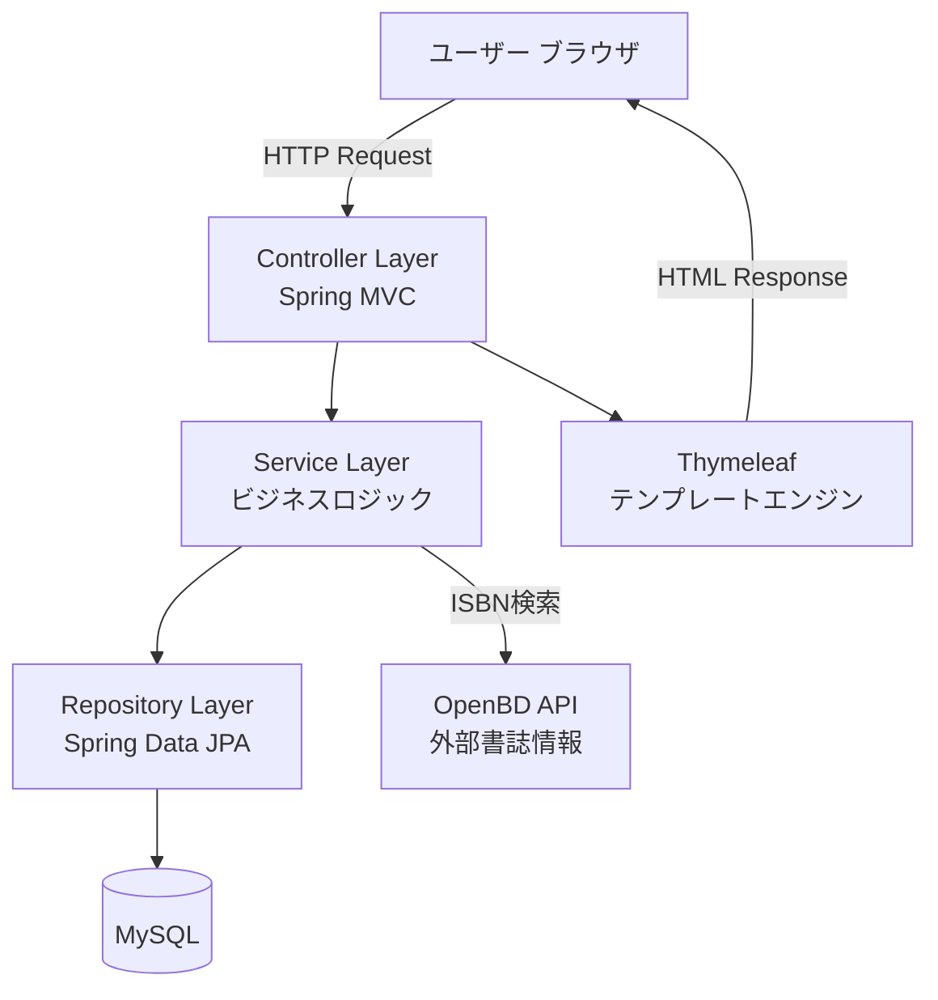
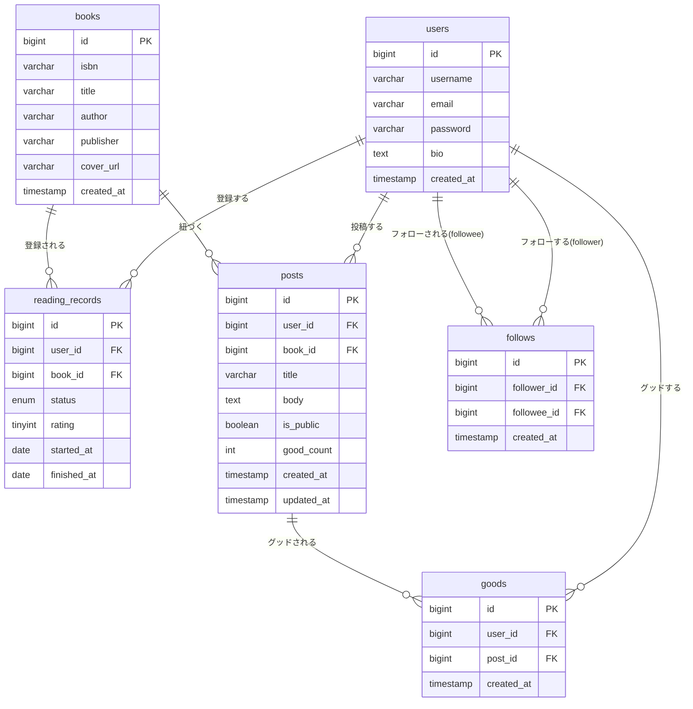
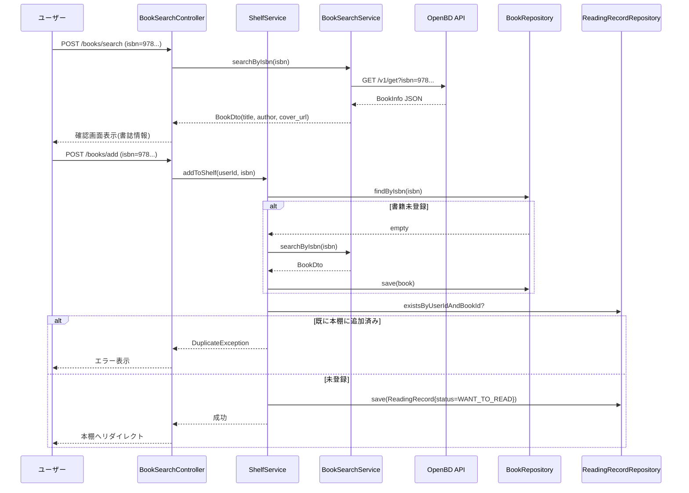
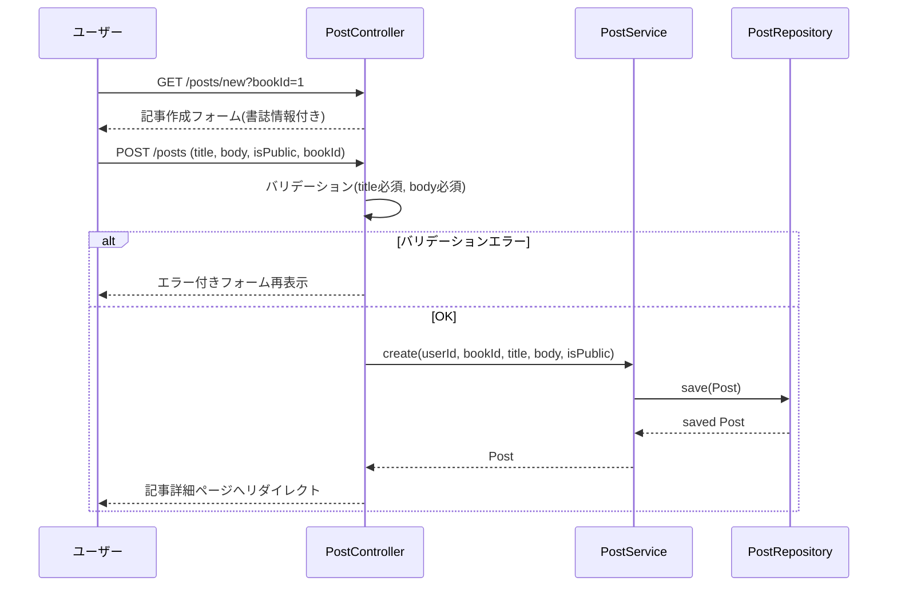
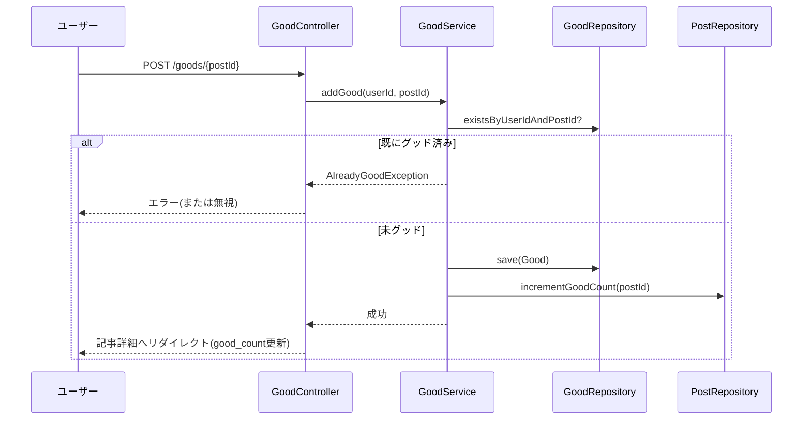
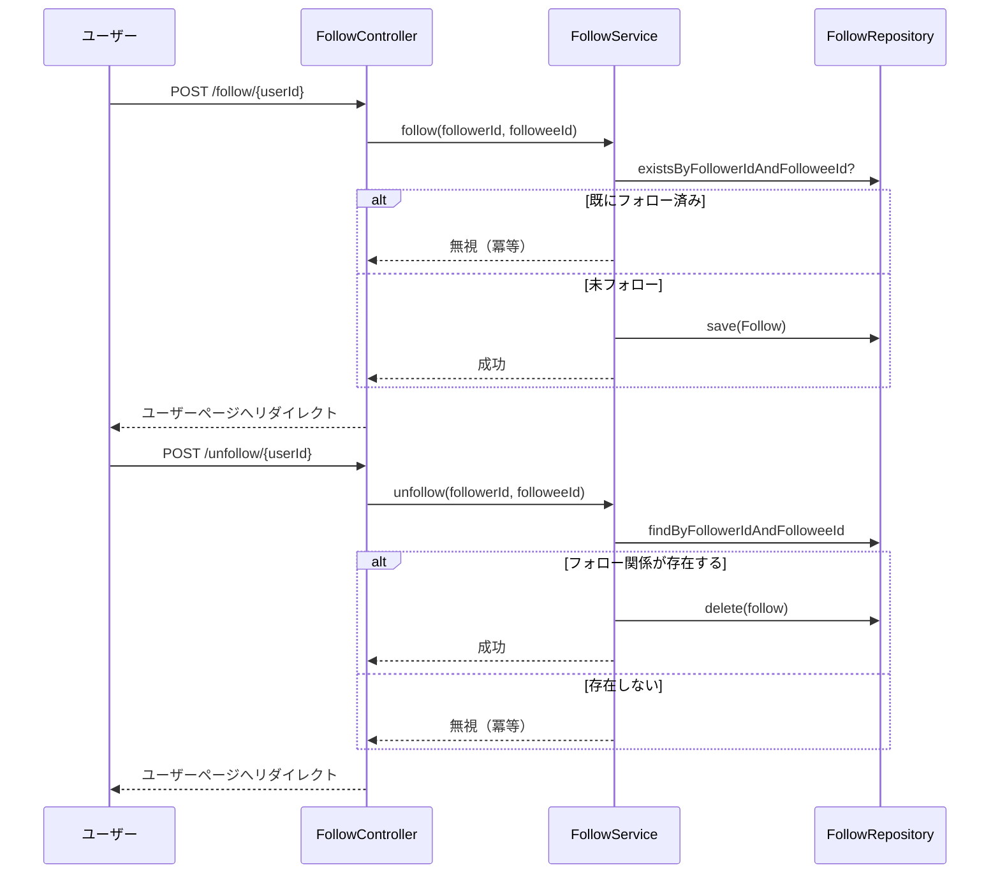
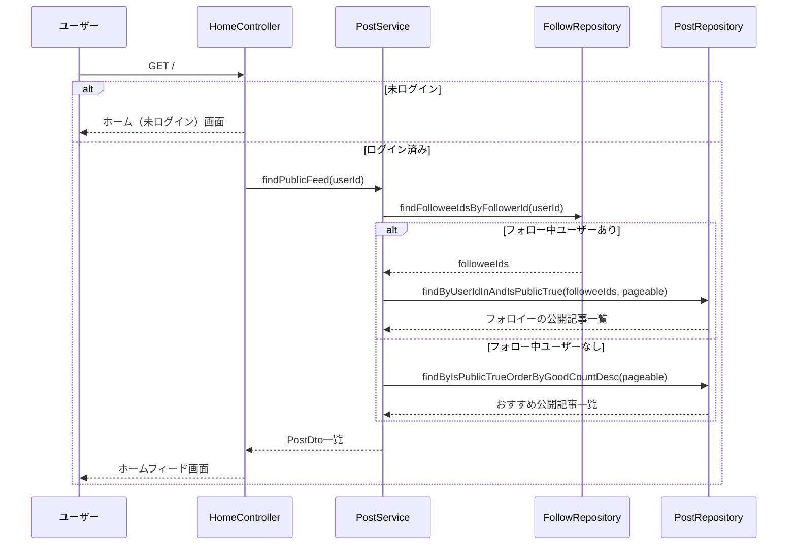
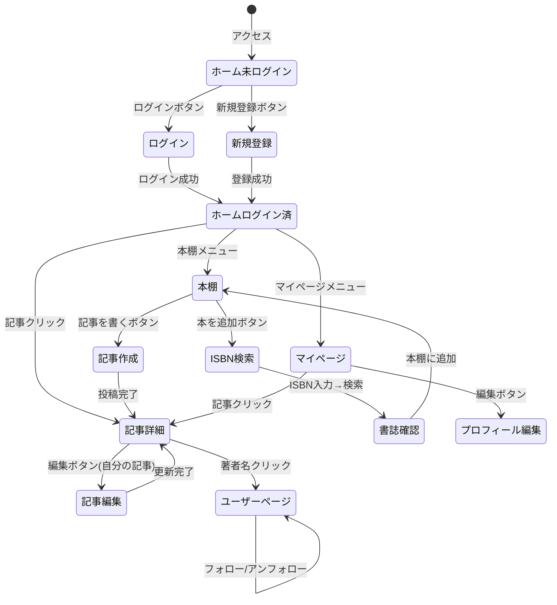

# 機能設計書 (Functional Design Document)

## システム構成図



---

## 技術スタック

| 分類 | 技術 | 選定理由 |
|------|------|----------|
| バックエンド | Spring Boot 3.x | Java標準のWebフレームワーク。Spring Security・JPA等のエコシステムが充実 |
| テンプレートエンジン | Thymeleaf | Spring Bootとの統合が容易。HTML5準拠のサーバーサイドレンダリング |
| 認証・認可 | Spring Security | CSRF対策・セッション管理・BCryptハッシュが標準で対応 |
| ORM | Spring Data JPA（Hibernate） | エンティティとDBのマッピング。CRUD操作を自動生成 |
| データベース | MySQL 8.x | リレーショナルデータの管理。本番環境に実績あり |
| 外部API | OpenBD API | ISBN→書誌情報の無料API。APIキー不要 |
| グラフ | Chart.js | フロントエンドJSライブラリ。月別読書冊数の棒グラフ描画 |
| ビルド | Maven | Spring Boot標準のビルドツール |
| デプロイ | Render / Railway | PaaS。無料〜低コストで本番運用可能 |

---

## データモデル定義

### エンティティ: User（ユーザー）

| カラム | 型 | 制約 | 説明 |
|--------|-----|------|------|
| id | BIGINT | PK, AUTO_INCREMENT | ユーザーID |
| username | VARCHAR(50) | NOT NULL, UNIQUE | 表示名 |
| email | VARCHAR(255) | NOT NULL, UNIQUE | ログインID |
| password | VARCHAR(255) | NOT NULL | BCryptハッシュ |
| bio | TEXT | NULL | 自己紹介 |
| created_at | TIMESTAMP | NOT NULL | 登録日時 |

**制約**:
- usernameは3〜50文字
- emailは有効なメールアドレス形式
- passwordはBCrypt（strength=12）でハッシュ化

---

### エンティティ: Book（書籍）

| カラム | 型 | 制約 | 説明 |
|--------|-----|------|------|
| id | BIGINT | PK, AUTO_INCREMENT | 書籍ID |
| isbn | VARCHAR(13) | NOT NULL, UNIQUE | ISBN-13 |
| title | VARCHAR(500) | NOT NULL | タイトル |
| author | VARCHAR(500) | NOT NULL | 著者名 |
| publisher | VARCHAR(255) | NULL | 出版社 |
| cover_url | VARCHAR(1000) | NULL | OpenBDから取得した書影URL |
| created_at | TIMESTAMP | NOT NULL | 登録日時 |

**制約**:
- ISBNはISBN-13形式（13桁数字）で正規化して保存
- タイトル・著者・出版社はOpenBDから取得した値をそのまま保存（ユーザー編集不可）
- 同一ISBNは1レコードのみ（複数ユーザーが同じ本を登録しても共有）

---

### エンティティ: ReadingRecord（読書記録 / 本棚エントリ）

| カラム | 型 | 制約 | 説明 |
|--------|-----|------|------|
| id | BIGINT | PK, AUTO_INCREMENT | 読書記録ID |
| user_id | BIGINT | FK → users.id | ユーザー |
| book_id | BIGINT | FK → books.id | 書籍 |
| status | ENUM | NOT NULL | WANT_TO_READ / READING / DONE |
| rating | TINYINT | NULL | 1〜5の星評価（DONEの場合のみ） |
| started_at | DATE | NULL | 読み始め日 |
| finished_at | DATE | NULL | 読了日 |

**制約**:
- (user_id, book_id) のペアはUNIQUE（同一ユーザーが同じ本を重複登録不可）
- ratingはDONEステータスのときのみ設定可（1〜5）
- DONEからWANT_TO_READ/READINGに戻した場合、ratingはNULLにリセットする

---

### エンティティ: Post（ブログ記事）

| カラム | 型 | 制約 | 説明 |
|--------|-----|------|------|
| id | BIGINT | PK, AUTO_INCREMENT | 記事ID |
| user_id | BIGINT | FK → users.id | 投稿者 |
| book_id | BIGINT | FK → books.id | 紐づく書籍 |
| title | VARCHAR(255) | NOT NULL | 記事タイトル |
| body | TEXT | NOT NULL | 記事本文 |
| is_public | BOOLEAN | NOT NULL, DEFAULT false | 公開フラグ |
| good_count | INT | NOT NULL, DEFAULT 0 | グッド数（非正規化） |
| created_at | TIMESTAMP | NOT NULL | 投稿日時 |
| updated_at | TIMESTAMP | NOT NULL | 更新日時 |

**制約**:
- titleは1〜255文字
- bodyは1文字以上
- good_countはGoodテーブルへの追加・削除時に同期更新

---

### エンティティ: Follow（フォロー）

| カラム | 型 | 制約 | 説明 |
|--------|-----|------|------|
| id | BIGINT | PK, AUTO_INCREMENT | フォローID |
| follower_id | BIGINT | FK → users.id | フォローする側 |
| followee_id | BIGINT | FK → users.id | フォローされる側 |
| created_at | TIMESTAMP | NOT NULL | フォロー日時 |

**制約**:
- (follower_id, followee_id) のペアはUNIQUE
- 自分自身をフォローできない（follower_id ≠ followee_id）

---

### エンティティ: Good（グッド / いいね）

| カラム | 型 | 制約 | 説明 |
|--------|-----|------|------|
| id | BIGINT | PK, AUTO_INCREMENT | グッドID |
| user_id | BIGINT | FK → users.id | グッドしたユーザー |
| post_id | BIGINT | FK → posts.id | グッドされた記事 |
| created_at | TIMESTAMP | NOT NULL | グッド日時 |

**制約**:
- (user_id, post_id) のペアはUNIQUE（同一ユーザーが同じ記事に2回グッド不可）

---

### ER図



---

## コンポーネント設計

### Controller層（Spring MVC）

各Controllerは対応するHTTPエンドポイントを持ち、ServiceへのDIとThymeleafテンプレートへのデータ渡しを担当する。

| Controller | 責務 |
|------------|------|
| `HomeController` | ホーム画面（未ログイン / ログイン済み） |
| `AuthController` | ユーザー登録・ログイン・ログアウト |
| `BookSearchController` | ISBN検索・書籍登録 |
| `ShelfController` | 本棚管理（一覧・ステータス変更・削除） |
| `PostController` | 記事作成・編集・削除・詳細表示 |
| `MyPageController` | マイページ・プロフィール編集 |
| `UserController` | 他ユーザーページ表示 |
| `FollowController` | フォロー・アンフォロー |
| `GoodController` | グッド追加・取り消し |

---

### Service層（ビジネスロジック）

| Service | 主なメソッド |
|---------|-------------|
| `UserService` | `register(email, username, password)` / `getUserByEmail(email)` |
| `BookSearchService` | `searchByIsbn(isbn): BookDto` ← OpenBD APIコール |
| `ShelfService` | `addToShelf(userId, isbn)` / `updateStatus(recordId, status, userId)` / `remove(recordId, userId)` / `checkOwnership(recordId, userId)` |
| `PostService` | `create(userId, bookId, title, body, isPublic)` / `update(postId, ...)` / `delete(postId)` / `findPublicFeed(userId)` |
| `FollowService` | `follow(followerId, followeeId)` / `unfollow(followerId, followeeId)` |
| `GoodService` | `addGood(userId, postId)` / `removeGood(userId, postId)` |
| `StatsService` | `getMonthlyReadCount(userId): Map<YearMonth, Integer>` |

---

### Repository層（Spring Data JPA）

| Repository | 主なクエリ |
|------------|-----------|
| `UserRepository` | `findByEmail` / `findByUsername` |
| `BookRepository` | `findByIsbn` |
| `ReadingRecordRepository` | `findByUserIdOrderByIdDesc` / `existsByUserIdAndBookId` / `findByUserIdAndBookId` |
| `PostRepository` | `findByUserIdOrderByCreatedAtDesc` / `findByIsPublicTrueOrderByCreatedAtDesc` / `findByFollowees(userId)` |
| `FollowRepository` | `existsByFollowerIdAndFolloweeId` / `findFolloweeIdsByFollowerId` |
| `GoodRepository` | `existsByUserIdAndPostId` / `countByPostId` |

---

### OpenBD APIクライアント

```
BookSearchService
  └── OpenBdApiClient
        ├── searchByIsbn(isbn: String): Optional<OpenBdBookDto>
        └── エンドポイント: GET https://api.openbd.jp/v1/get?isbn={isbn}
```

**レスポンスのマッピング**:
- `summary.isbn` → isbn
- `summary.title` → title
- `summary.author` → author
- `summary.publisher` → publisher
- `onix.CollateralDetail.SupportingResource[0].ResourceLink` → cover_url

**エラー処理**:
- APIタイムアウト（3秒以上）→ エラーメッセージ表示
- レスポンスがnullまたは空配列 → 「該当書籍が見つかりません」表示

---

## 主要ユースケース（シーケンス図）

### 1. ISBN検索・本棚追加



---

### 2. 記事作成



---

### 3. グッド追加



---

### 4. フォロー・アンフォロー



---

### 5. ホームフィード取得



---

## 画面遷移図



---

## 画面・エンドポイント一覧

| 画面名 | HTTPメソッド | パス | 認証要否 |
|--------|------------|------|---------|
| ホーム | GET | `/` | 不要 |
| 新規登録フォーム | GET | `/register` | 不要 |
| 新規登録処理 | POST | `/register` | 不要 |
| ログインフォーム | GET | `/login` | 不要 |
| ログアウト | POST | `/logout` | 要 |
| ISBN検索フォーム | GET | `/books/search` | 要 |
| ISBN検索実行 | POST | `/books/search` | 要 |
| 本棚追加処理 | POST | `/books/add` | 要 |
| 本棚一覧 | GET | `/shelf` | 要 |
| 読書記録更新 | POST | `/shelf/{recordId}/status` | 要 |
| 本棚から削除 | POST | `/shelf/{recordId}/delete` | 要 |
| 記事作成フォーム | GET | `/posts/new` | 要 |
| 記事作成処理 | POST | `/posts` | 要 |
| 記事詳細 | GET | `/posts/{postId}` | 不要（公開記事） |
| 記事編集フォーム | GET | `/posts/{postId}/edit` | 要（本人のみ） |
| 記事更新処理 | POST | `/posts/{postId}/edit` | 要（本人のみ） |
| 記事削除処理 | POST | `/posts/{postId}/delete` | 要（本人のみ） |
| マイページ | GET | `/mypage` | 要 |
| プロフィール編集 | GET / POST | `/mypage/edit` | 要 |
| ユーザーページ | GET | `/users/{username}` | 不要 |
| 本の詳細ページ | GET | `/books/{bookId}` | 不要 |
| フォロー | POST | `/follow/{userId}` | 要 |
| アンフォロー | POST | `/unfollow/{userId}` | 要 |
| グッド追加 | POST | `/goods/{postId}` | 要 |
| グッド取り消し | POST | `/goods/{postId}/remove` | 要 |

---

## 認証・認可設計

### Spring Security設定

```
SecurityConfig
├── permitAll: GET /, /login, /register, /posts/{id}(公開), /users/{username}, /books/{bookId}
├── authenticated: その他すべて
├── CSRF: 有効（formによるPOST時にトークン付与）
├── Session: セッションベース認証
└── PasswordEncoder: BCryptPasswordEncoder(strength=12)
```

### アクセス制御ルール

| リソース | アクセス可否 |
|---------|------------|
| 他ユーザーの非公開記事 | 不可（PostServiceでチェック） |
| 他ユーザーの読書記録 | 不可 |
| 他ユーザーの読書記録の更新・削除 | 不可（ShelfServiceでcheckOwnership） |
| 自分以外の記事編集・削除 | 不可（PostServiceでcheckOwnership） |
| 自分以外のプロフィール編集 | 不可 |

---

## 月別読書グラフ設計（Chart.js）

### データ取得

`StatsService#getMonthlyReadCount(userId)` が過去12ヶ月分の読了冊数を返す。

```sql
SELECT DATE_FORMAT(finished_at, '%Y-%m') AS month, COUNT(*) AS count
FROM reading_records
WHERE user_id = ? AND status = 'DONE' AND finished_at IS NOT NULL
  AND finished_at >= DATE_SUB(CURDATE(), INTERVAL 12 MONTH)
GROUP BY month
ORDER BY month ASC;
```

### フロントエンド実装

Thymeleafがグラフデータを `<script>` タグ内のJS変数としてHTMLに埋め込む。Chart.jsの棒グラフ（Bar Chart）で描画する。

```html
<script>
const chartData = /*[[${chartDataJson}]]*/ {};
// Chart.jsでレンダリング
</script>
```

---

## エラーハンドリング

### エラーの分類

| エラー種別 | 発生箇所 | 処理 | ユーザーへの表示 |
|-----------|---------|------|-----------------|
| バリデーションエラー | Controller | フォームに`BindingResult`でエラー返却 | フォームの各フィールドにエラーメッセージ表示 |
| ISBN未発見 | BookSearchService | `BookNotFoundException`をスロー | 「この書籍はOpenBDに登録されていません」 |
| OpenBD APIタイムアウト | OpenBdApiClient | `ExternalApiException`をスロー | 「書誌情報の取得に失敗しました。しばらく後で再試行してください」 |
| 重複本棚登録 | ShelfService | `DuplicateRecordException`をスロー | 「この本はすでに本棚に登録されています」 |
| 認証エラー | Spring Security | 403リダイレクト | ログインページへリダイレクト |
| 権限エラー | Service | `AccessDeniedException`をスロー | 403エラーページ |
| リソース未発見 | Service | `ResourceNotFoundException`をスロー | 404エラーページ |
| DB接続エラー | Repository | `DataAccessException` | 500エラーページ（汎用エラー） |

### グローバルエラーハンドラー

`@ControllerAdvice` で共通エラーページにルーティングする。

```
GlobalExceptionHandler
├── ResourceNotFoundException → 404.html
├── AccessDeniedException → 403.html
└── Exception（その他すべて） → 500.html
```

---

## セキュリティ考慮事項

| 脅威 | 対策 |
|------|------|
| CSRF | Spring SecurityのCSRFトークンをすべてのPOSTフォームに付与 |
| SQLインジェクション | Spring Data JPA（パラメータバインディング）を使用 |
| XSS | ThymeleafのHTMLエスケープ（デフォルト有効） |
| パスワード漏洩 | BCrypt(strength=12)でハッシュ化 |
| 不正アクセス | ServiceレイヤーでuserIdチェック（他人のリソース操作不可） |
| OpenBDデータ改変 | 書誌情報フィールドをUIで編集不可にする |
| 書誌データ削除要請 | 管理者URLで書籍レコードを削除できる管理機能を実装 |

---

## テスト戦略

### ユニットテスト（JUnit 5 + Mockito）

- `BookSearchService`: OpenBD APIのレスポンスパターン（正常・ISBN未発見・タイムアウト）
- `ShelfService`: 重複チェック・ステータス遷移のロジック
- `PostService`: 公開フラグ制御・所有権チェック
- `GoodService`: 重複グッドの防止ロジック
- `StatsService`: 月別集計クエリの結果変換

### 統合テスト（Spring Boot Test + TestContainers）

- `ReadingRecordRepository`: (user_id, book_id) のUNIQUE制約
- `PostRepository`: is_public=trueのみ返す公開記事クエリ
- `FollowRepository`: フォロー・フォロワー関係の取得

### E2Eテスト（手動 / Selenium）

- 新規ユーザー登録→ISBN検索→本棚追加→記事作成→公開→他ユーザーから閲覧 の一連フロー
- ログインしていない状態での非公開記事へのアクセス拒否確認
