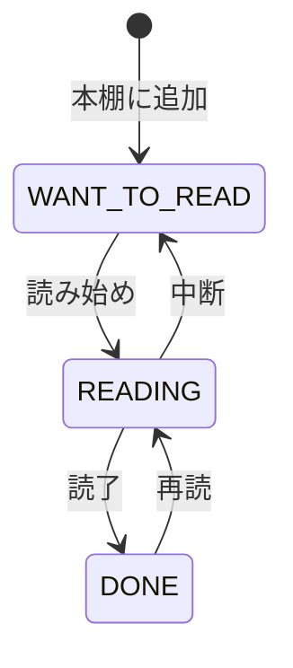

# プロジェクト用語集 (Glossary)

## 概要

このドキュメントは、Bukuroプロジェクト内で使用される用語の定義を管理します。

**更新日**: 2026-05-23

---

## ドメイン用語

### 本棚（マイシェルフ）

**定義**: ユーザーが登録した書籍と読書状況の一覧。ユーザーごとに管理される。

**説明**: ISBNで本を検索・登録すると本棚に追加される。ステータス（積読・読中・読了）と星評価で管理できる。本棚は個人の読書履歴の核となる概念。

**関連用語**: [読書記録](#読書記録)、[読書ステータス](#読書ステータス)、[書籍](#書籍)

**使用例**:
- 「本棚に追加する」: ISBNを検索して書籍を自分の本棚に登録する
- 「本棚画面」: ステータス別タブで自分の登録書籍を一覧表示する画面

**英語表記**: Shelf / My Shelf

**対応データモデル**: `ReadingRecord`（reading_recordsテーブル）

---

### 読書記録

**定義**: ユーザーと書籍の紐づき情報。読書ステータス・評価・日付を含む本棚エントリの単位。

**説明**: 1ユーザー × 1書籍で1レコードが作成される。同じ本を2回登録することはできない。読書ステータスと星評価を更新しながら読書の進捗を記録する。

**関連用語**: [本棚](#本棚（マイシェルフ）)、[読書ステータス](#読書ステータス)、[星評価](#星評価)

**英語表記**: Reading Record

---

### 読書ステータス

**定義**: 書籍の読書進行状態を示す3段階の値。

| 値 | 表示名 | 意味 |
|----|--------|------|
| `WANT_TO_READ` | 積読 | 読む予定はあるが未読。まだ手をつけていない |
| `READING` | 読中 | 現在読んでいる最中 |
| `DONE` | 読了 | 読み終わった。星評価の設定が可能になる |

**状態遷移図**:


**ビジネスルール**:
- 星評価は `DONE` 状態のときのみ設定できる
- 読み始め日は `READING` または `DONE` のときに記録する
- 読了日は `DONE` のときに記録する

**英語表記**: Reading Status

---

### 星評価

**定義**: 書籍への満足度を1〜5の整数で表現した評価値。

**説明**: 読了（`DONE`）ステータスの本にのみ設定できる。5が最高評価。本棚画面・ユーザーページで表示される。

**関連用語**: [読書ステータス](#読書ステータス)

**英語表記**: Rating

---

### 記事

**定義**: ユーザーが特定の書籍に紐づけて書いたブログ形式の感想・レビュー。

**説明**: 本棚に登録済みの書籍に対して書くことができる。タイトルと本文から構成され、公開・非公開を選択できる。公開記事は未ログインユーザーを含む全員が閲覧できる。

**関連用語**: [書籍](#書籍)、[公開設定](#公開設定)、[グッド](#グッド)

**英語表記**: Post

**対応データモデル**: `Post`（postsテーブル）

**使用例**:
- 「記事を書く」: 本棚に登録済みの書籍を選び、タイトルと本文を入力して投稿する
- 「記事を公開する」: `is_public = true` に設定して全ユーザー（未ログイン含む）が閲覧できる状態にする
- 「記事詳細ページ」: 記事本文・書誌情報・グッド数が表示される画面（`/posts/{postId}`）

---

### グッド

**定義**: ログインユーザーが記事に付ける「いいね」リアクション。

**説明**: 1ユーザーが1記事に1回のみ押せる。グッドの取り消しも可能。グッド数は`posts.good_count`に非正規化して保持し、一覧表示でのN+1クエリを防ぐ。

**関連用語**: [記事](#記事)

**英語表記**: Good

**対応データモデル**: `Good`（goodsテーブル）

---

### フォロー

**定義**: あるユーザーが別のユーザーの公開記事をフォローする一方向の関係。

**説明**: フォローすると、ホームフィードにフォロー中ユーザーの新着記事が表示される。フォロー通知機能は初期実装では提供しない。自分自身はフォローできない。

**関連用語**: [フォロワー](#フォロワー)、[フォロイー](#フォロイー)

**英語表記**: Follow

**対応データモデル**: `Follow`（followsテーブル）

---

### フォロワー

**定義**: あるユーザーをフォローしているユーザー。`follows.follower_id`が参照するユーザー。

**英語表記**: Follower

---

### フォロイー

**定義**: あるユーザーにフォローされているユーザー。`follows.followee_id`が参照するユーザー。

**英語表記**: Followee

---

### 書籍

**定義**: ISBNで識別される書誌情報の単位。booksテーブルに保存される。

**説明**: 複数のユーザーが同じ本を登録しても書籍レコードは共有される（同一ISBNは1レコード）。書誌情報はOpenBDから取得し、ユーザーによる編集はOpenBD利用規約により禁止。書影URLはOpenBDのCDNを参照する。

**関連用語**: [読書記録](#読書記録)、[OpenBD API](#openbd-api)

**英語表記**: Book

**対応データモデル**: `Book`（booksテーブル）

---

### 公開設定

**定義**: 記事ごとに設定できる「公開」または「非公開」の状態。

| 設定 | 意味 | 閲覧可能なユーザー |
|------|------|-----------------|
| 公開（`is_public = true`） | 全体公開 | 全ユーザー（未ログインを含む） |
| 非公開（`is_public = false`） | 自分のみ | 記事の投稿者のみ |

**英語表記**: Visibility / Public Setting

---

### ホームフィード

**定義**: ログイン後のホーム画面に表示される、フォロー中ユーザーの最新公開記事一覧。

**説明**: フォロー中ユーザーがいない場合は全公開記事からグッド数順または新着順で「おすすめ記事」を表示する。新着順（created_at DESC）でページネーション表示。

**関連用語**: [フォロー](#フォロー)、[記事](#記事)

**英語表記**: Home Feed

---

### ステアリングファイル

**定義**: 特定の開発作業における「今回何をするか」を定義する一時的なドキュメント群。

**説明**: `.steering/[YYYYMMDD]-[task-name]/` ディレクトリに `requirements.md`・`design.md`・`tasklist.md` の3ファイルを作成する。作業単位で作成し、完了後も履歴として保持する。

**ディレクトリ構造**:
```
.steering/
└── 20250523-add-post-feature/
    ├── requirements.md   # 今回の作業の要求内容
    ├── design.md         # 変更内容の設計
    └── tasklist.md       # タスクリスト
```

**英語表記**: Steering File

---

## 技術用語

### OpenBD API

**定義**: 日本の書籍の書誌情報・書影を無料で提供するWeb API。

**公式サイト**: https://openbd.jp/

**本プロジェクトでの用途**: ISBNから書籍のタイトル・著者・出版社・書影URLを取得するために使用。APIキー不要・無料。

**バージョン**: v1

**利用上の注意**:
- 利用条件: 本の販促・紹介目的に限る（読書記録サービスは適合）
- データの改変禁止: タイトル・著者等をユーザーが編集できる機能はNG
- 削除要請への対応: 管理者が書籍レコードを削除できる機能が必要
- タイムアウト設定: `openbd.api.timeout-seconds=3`（3秒でタイムアウト）

**エンドポイント**:
```
GET https://api.openbd.jp/v1/get?isbn={ISBN-13}
```

**関連ドキュメント**: [アーキテクチャ設計書](./architecture.md#openbd-api-利用上の制約)

---

### Spring Boot

**定義**: JavaでWebアプリケーションを開発するためのフレームワーク。

**本プロジェクトでの用途**: バックエンド全体。Spring MVC・Spring Security・Spring Data JPAを統合して使用。

**バージョン**: 3.3.x

**関連ドキュメント**: [アーキテクチャ設計書](./architecture.md)

---

### Spring Security

**定義**: Spring Bootに統合された認証・認可フレームワーク。

**本プロジェクトでの用途**: セッションベースのログイン認証・CSRF対策・URL単位のアクセス制御。

**バージョン**: 6.x（Spring Boot 3.3.x内包）

---

### Thymeleaf

**定義**: サーバーサイドHTMLテンプレートエンジン。Spring MVCと統合して使用。

**本プロジェクトでの用途**: すべての画面をサーバーサイドレンダリングで生成。`th:text`によるHTMLエスケープでXSSを防ぐ。

**バージョン**: 3.x（Spring Boot 3.3.x内包）

---

### Spring Data JPA / Hibernate

**定義**: JavaのORMフレームワーク。エンティティクラスとDBテーブルをマッピングし、SQLを自動生成する。

**本プロジェクトでの用途**: Repositoryインターフェースを定義するだけでCRUDメソッドを自動生成。カスタムクエリはJPQL（`@Query`）で記述。

**バージョン**: JPA 3.x / Hibernate 6.x（Spring Boot 3.3.x内包）

---

### Chart.js

**定義**: JavaScriptのグラフ描画ライブラリ。ブラウザ上でHTMLの`<canvas>`に描画する。

**本プロジェクトでの用途**: マイページの「月別読書冊数グラフ」（棒グラフ）の描画。CDN経由で読み込む。

**バージョン**: 4.x

---

### TestContainers

**定義**: JUnit 5テスト中にDockerコンテナを起動するJavaライブラリ。

**本プロジェクトでの用途**: Repository統合テストでMySQLコンテナを起動し、実際のDBでクエリ・制約を検証する。

**バージョン**: 最新安定版

---

## 略語・頭字語

### ISBN

**正式名称**: International Standard Book Number（国際標準図書番号）

**意味**: 書籍を一意に識別するための国際的な番号体系。

**本プロジェクトでの使用**:
- ISBN-13（13桁）を標準として使用
- ISBN-10（10桁）が入力された場合はISBN-13に変換してOpenBD APIへ送信
- booksテーブルの`isbn`カラムに保存（UNIQUE制約）

---

### DTO

**正式名称**: Data Transfer Object

**意味**: レイヤー間でデータを受け渡すためのオブジェクト。

**本プロジェクトでの使用**:
- JPAエンティティをそのままViewに渡さず、DTOに変換してからControllerがModelに追加する
- `PostDto`（記事表示用）、`BookDto`（ISBN検索結果）、`PostForm`（記事作成フォーム）など

**実装箇所**: `src/main/java/com/bukuro/dto/`

---

### JPA

**正式名称**: Jakarta Persistence API（旧: Java Persistence API）

**意味**: JavaでリレーショナルDBを操作するための標準API仕様。Hibernateが実装を提供。

**本プロジェクトでの使用**: エンティティクラスの`@Entity`アノテーション、Repositoryインターフェースの基底クラス

---

### CSRF

**正式名称**: Cross-Site Request Forgery（クロスサイトリクエストフォージェリ）

**意味**: 攻撃者が正規ユーザーの権限で意図しないリクエストを送信させるWeb攻撃。

**本プロジェクトでの対策**: Spring SecurityのCSRFトークンを全POSTフォームに付与。Thymeleafは`th:action`を使用することでトークンを自動挿入。

---

### XSS

**正式名称**: Cross-Site Scripting（クロスサイトスクリプティング）

**意味**: 悪意あるスクリプトをWebページに埋め込む攻撃。

**本プロジェクトでの対策**: ThymeleafのデフォルトHTMLエスケープ（`th:text`）。`th:utext`はユーザー入力を表示する箇所では絶対に使わない。

---

### BCrypt

**正式名称**: Blowfish Crypt（bcrypt）

**意味**: パスワードハッシュ化のための適応型ハッシュ関数。コストパラメーター（strength）によってハッシュ計算コストを調整でき、将来のハードウェア高速化に合わせてコストを引き上げることでブルートフォース攻撃への耐性を維持できる。

**本プロジェクトでの使用**: `BCryptPasswordEncoder(strength=12)` でユーザーのパスワードをハッシュ化して保存。平文パスワードはDBに保存しない。

**実装箇所**: `SecurityConfig.java`（`PasswordEncoder` Bean定義）

---

## アーキテクチャ用語

### レイヤードアーキテクチャ

**定義**: システムを役割ごとに複数の層に分割し、上位層から下位層への一方向の依存関係を持たせる設計パターン。

**本プロジェクトでの適用**:

```
Presentation Layer（Controller + Thymeleaf）
            ↓
Service Layer（@Service）
            ↓
Repository Layer（@Repository / JPA）
            ↓
Database（MySQL）
```

**依存関係のルール**:
- ✅ Controller → Service → Repository
- ❌ Repository → Service（逆依存禁止）
- ❌ Controller → Repository（Serviceを飛ばした直接アクセス禁止）

**関連ドキュメント**: [アーキテクチャ設計書](./architecture.md#アーキテクチャパターン)

---

### N+1問題

**定義**: 1回のリスト取得クエリに加え、各要素のデータ取得のためにN回の追加クエリが発生するパフォーマンス問題。

**本プロジェクトでの対策**:
- `good_count`をpostsテーブルに非正規化して保持（グッド数の集計クエリ不要）
- 一覧表示ではページネーション（20件/ページ）でデータ量を制限
- JPAの`@EntityGraph`またはJPQLの`JOIN FETCH`で関連データを一括取得

---

## ステータス・状態

### 読書ステータス（ReadingStatus Enum）

| 値（Java Enum） | DB値（ENUM） | 表示名 | 説明 |
|---------------|-----------|--------|------|
| `WANT_TO_READ` | `WANT_TO_READ` | 積読 | 未読・積ん読 |
| `READING` | `READING` | 読中 | 現在読んでいる |
| `DONE` | `DONE` | 読了 | 読み終わった |

**実装箇所**: `com.bukuro.entity.ReadingStatus`

---

## データモデル用語

### User（ユーザー）

**定義**: サービスの登録ユーザーを表すエンティティ。

**主要フィールド**:
- `id`: BIGINT PK、ユーザーID
- `username`: 表示名（3〜50文字、ユニーク）
- `email`: ログインID（メールアドレス形式、ユニーク）
- `password`: BCryptハッシュ（平文を保存しない）
- `bio`: 自己紹介テキスト（NULL可）

---

### Book（書籍）

**定義**: OpenBDから取得したISBN単位の書誌情報を保存するエンティティ。

**主要フィールド**:
- `isbn`: ISBN-13（13桁、ユニーク）
- `title` / `author` / `publisher`: OpenBDから取得。編集不可
- `cover_url`: 書影URL（OpenBD CDN参照。削除・変更リスクあり）

**制約**: 同一ISBNは1レコードのみ（複数ユーザーが同じ本を登録しても共有）

---

### ReadingRecord（読書記録）

**定義**: ユーザーと書籍の本棚エントリを表すエンティティ。

**主要フィールド**:
- `user_id` / `book_id`: 複合ユニーク制約（同一ユーザーが同じ本を2回登録不可）
- `status`: ReadingStatus Enum
- `rating`: 1〜5の星評価（DONEのときのみ設定可。ステータスを戻した場合はNULLにリセット）
- `started_at`: 読み始め日（DATE型、NULL可。READING/DONEのときに記録）
- `finished_at`: 読了日（DATE型、NULL可。DONEのときに記録）

---

### Post（記事）

**定義**: ユーザーが書籍に紐づけて投稿したブログ記事エンティティ。

**主要フィールド**:
- `is_public`: 公開フラグ（defaultはfalse=非公開）
- `good_count`: グッド数（非正規化。Goodテーブルと同期して更新）
- `body`: 記事本文（TEXT型）

---

## エラー・例外

### BookNotFoundException

**クラス名**: `BookNotFoundException`

**発生条件**: OpenBD APIに問い合わせた結果、該当するISBNの書籍が見つからない場合。

**対処方法**:
- ユーザー: ISBNの入力を確認し、再試行する
- 開発者: OpenBD APIのレスポンスログを確認する

**HTTPレスポンス**: 400 Bad Request（書誌情報確認画面にエラーメッセージ表示）

---

### DuplicateRecordException

**クラス名**: `DuplicateRecordException`

**発生条件**:
- 同じ本を本棚に2回追加しようとした場合（`reading_records`のUNIQUE制約違反）
- 同じ記事に2回グッドしようとした場合（`goods`のUNIQUE制約違反）

**対処方法**:
- ユーザー: すでに登録済みであることを確認する
- 開発者: DB側のUNIQUE制約と整合しているか確認する

---

### AccessDeniedException

**クラス名**: `AccessDeniedException`

**発生条件**: 他ユーザーのリソース（記事・読書記録）を編集・削除しようとした場合。Serviceレイヤーのオーナーシップチェックで発生。

**HTTPレスポンス**: 403 Forbidden（`error/403.html`）

---

### ResourceNotFoundException

**クラス名**: `ResourceNotFoundException`

**発生条件**: 指定されたID（記事・ユーザー・書籍）が存在しない場合。

**HTTPレスポンス**: 404 Not Found（`error/404.html`）

---

### ExternalApiException

**クラス名**: `ExternalApiException`

**発生条件**: OpenBD APIのタイムアウト（3秒超過）またはHTTPエラーが発生した場合。

**対処方法**:
- ユーザー: しばらく後に再試行する
- 開発者: OpenBD APIのステータスを確認する。アプリ全体は継続稼働させる

---

## 索引

### あ行
- [アーキテクチャ（レイヤードアーキテクチャ）](#レイヤードアーキテクチャ)

### か行
- [記事](#記事)
- [グッド](#グッド)
- [公開設定](#公開設定)
- [書籍](#書籍)

### さ行
- [星評価](#星評価)
- [ステアリングファイル](#ステアリングファイル)

### た行
- [テスト（TestContainers）](#testcontainers)

### な行
- [N+1問題](#n1問題)

### は行
- [本棚](#本棚（マイシェルフ）)
- [フォロー](#フォロー)
- [フォロイー](#フォロイー)
- [フォロワー](#フォロワー)

### ま行
- [マイシェルフ](#本棚（マイシェルフ）)

### や行
- [読書記録](#読書記録)
- [読書ステータス](#読書ステータス)

### ら行
- [読書ステータス](#読書ステータス)

### A-Z
- [BCrypt](#bcrypt)
- [Chart.js](#chartjs)
- [CSRF](#csrf)
- [DTO](#dto)
- [ISBN](#isbn)
- [JPA](#jpa)
- [OpenBD API](#openbd-api)
- [Spring Boot](#spring-boot)
- [Spring Security](#spring-security)
- [Thymeleaf](#thymeleaf)
- [XSS](#xss)
